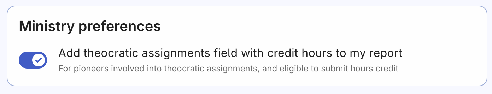
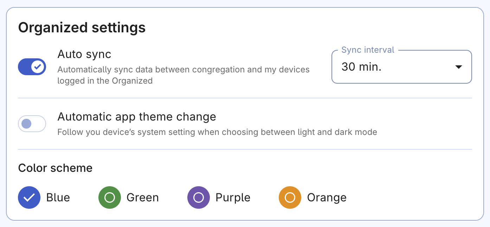

# Personal preferences

There are some settings that change app's appearence or help you to adjust its functionality according to your needs and type of your service.

## Ministry preferences

#### Add theocratic assignments field to my report. 
This setting adds credit hours to your service report. It lets you record time spent on building projects, assisting at Bethel, or other approved activities. If you're a pioneer and have permission to report credit hours, make sure to utilize this option.

## Organized settings

- **Automatic sync:** Allows you use your account on multiple devices. For appointed brothers, this also allows to sync their entered info with others in the congregation – such as meeting schedules, events and activities. Don't turn it on, if you want to use the app in the local-only mode.
- **Automatic sync:** Select an interval of updating the info between your devices and others in your congregation. By default, the update interval is set to 5 minutes. We recommend keeping it at 5 minutes unless you have a very limited internet connection or data plan.
- **Automatic app theme change:** When turned on, the Organized will use the same theme as your device – either dark or light. If you want to manually switch the theme, you will be asked to confirm turning off the automatic app theme change.
- **Color scheme:** Customize app's look and feel according to your preferences. Select a color you like and the app will use it scross all pages.

