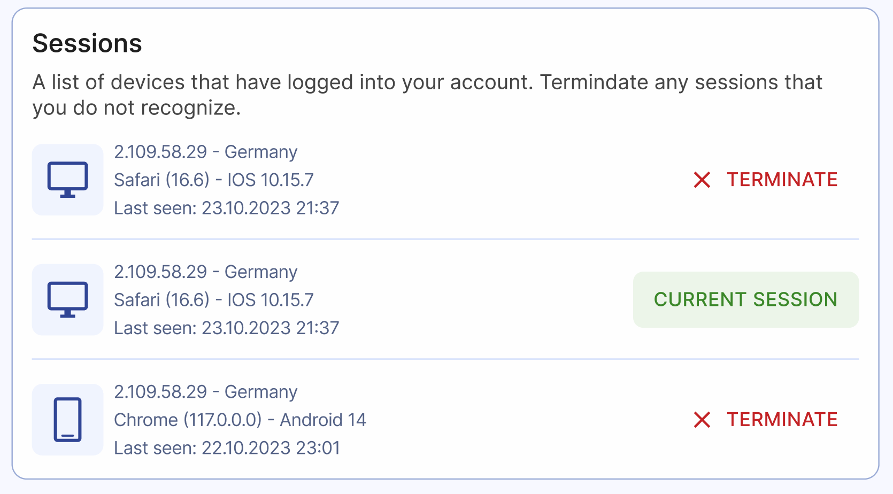
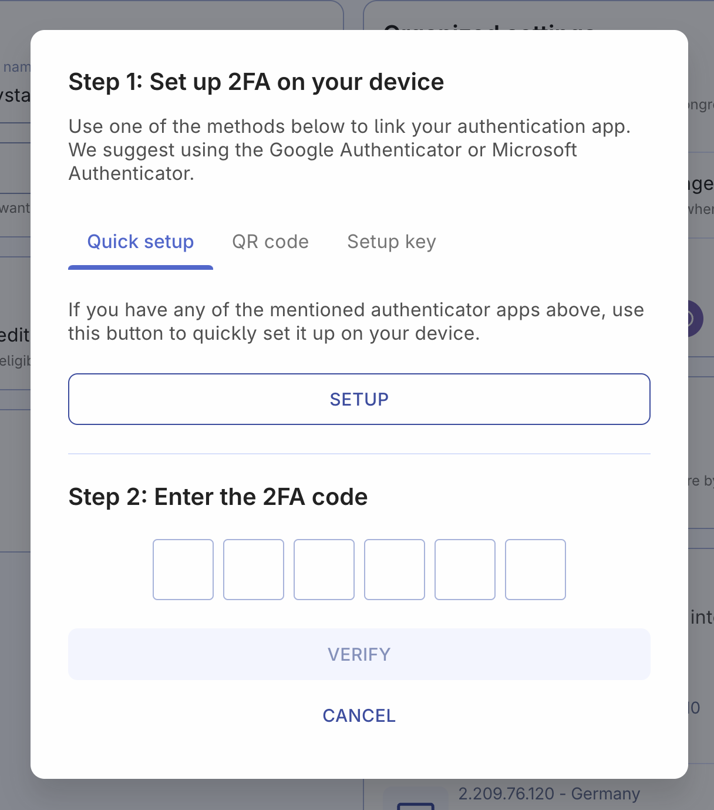

# Security and sessions

Security is a very important aspect of the Organized app, and we take it seriously to protect your data and ensure the safety of your account. We've implemented numerous security measure to keep all your information safe, and even more features are in the development. However, it's essential to remember that achieving the highest level of security requires everyone's responsibility and correct usage of the provided tools.

## Sessions

Each session represents a device or browser where you've logged into your Organized account. The current session shows the device you're currently using to view the page.

Terminating any session will remove your Organized account from that device or browser. If you notice any sessions from unfamiliar locations or devices, you can terminate them with a single click to keep your account secure.

## Two-factor authentication (2FA)

Two-factor authentication (2FA) boosts your account's security. You'll need to enter a one-time code from a mobile app, such as Google Authenticator or Microsoft Authenticator. To begin, click on "Enable 2FA." If you ever want to, you can turn it off later. However, we recommend appointed brothers to have 2FA turned on.

### To set up the 2FA, simply activate the toggle and follow the instructions in the app. It's just two simple steps:

1. Set up 2FA (two-factor authentication) on your device. You can choose from the following methods:

- _Quick setup:_ If you're opening the app on the same device where the Google or Microsoft authenticator app is installed, use this method. After clicking it, you will be automatically redirected to your authenticator app.
  – _QR code:_ If you're using a different device for the authenticator app, choose this method. Scan the QR code displayed in the Organized app using your authenticator app.
- _Setup key:_ If you cannot use the QR code, manually copy and paste the setup key provided in the Organized app into your authenticator app.

2. Enter the 2FA code that you got from your authenticator app after setting it up.

