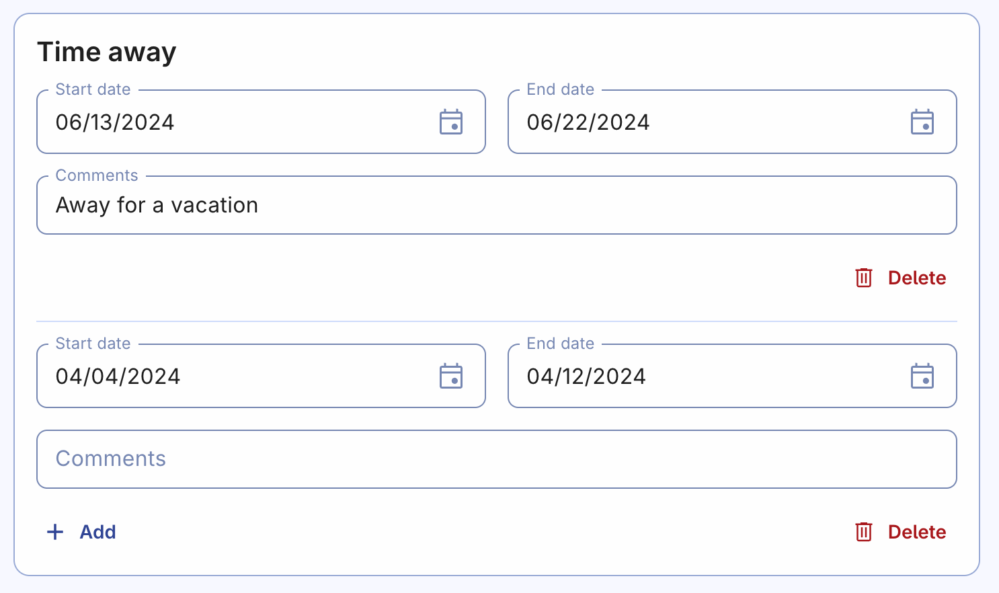

---
sidebar_position: 5
---

# Time away

If you know that you won't be available to complete assignments during certain periods, you can add one or more "away periods" in the Organized app. By doing this, the brother responsible for creating the schedule will be able to take your unavailability into account when generating new schedules for the dates you've entered. This helps ensure that tasks are assigned fairly and efficiently, and that your absence is considered during the scheduling process.

## Add a time away period

To add an away period, follow these steps:

1. Click **"Add"** button
2. Enter the start and end dates for the period during which you won't be available.
3. Optionally, you can include a comment about your unavailability if you think it would be helpful or relevant.
4. If there are multiple periods, you can add more by clicking **"Add"** once again.

By adding away periods, you help the scheduler make informed decisions when assigning tasks, even during times when you're unavailable. Keep it updated to help responsible brothers and yourself.

