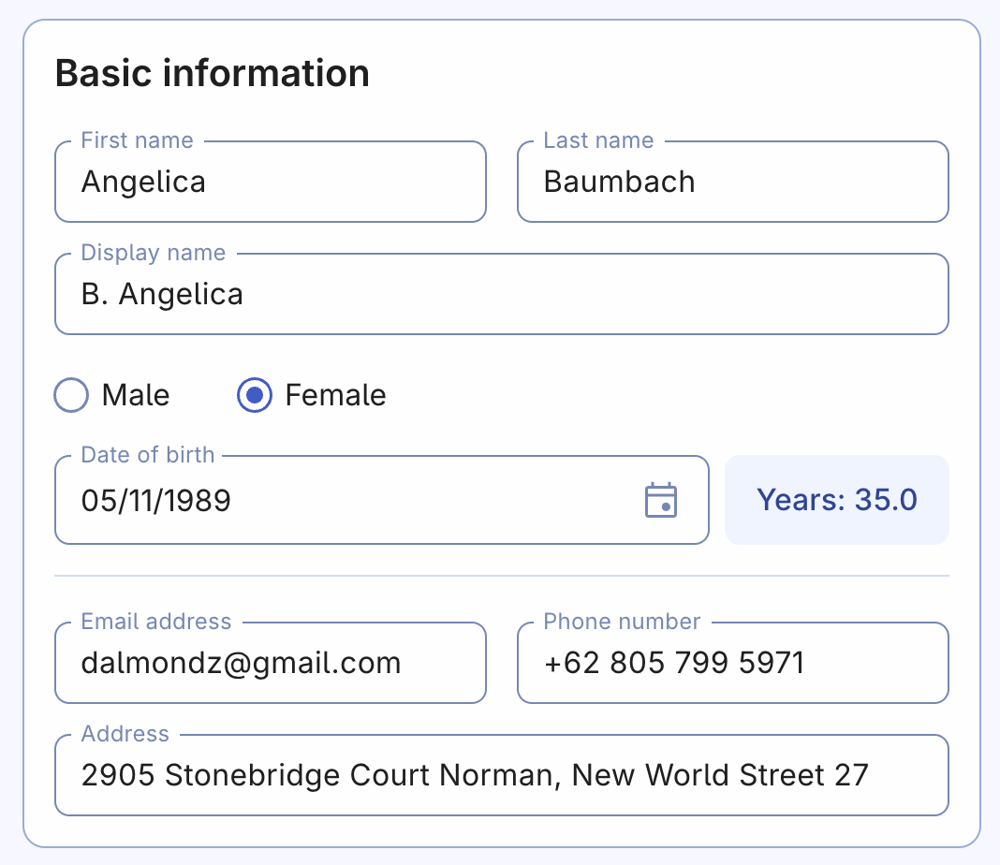
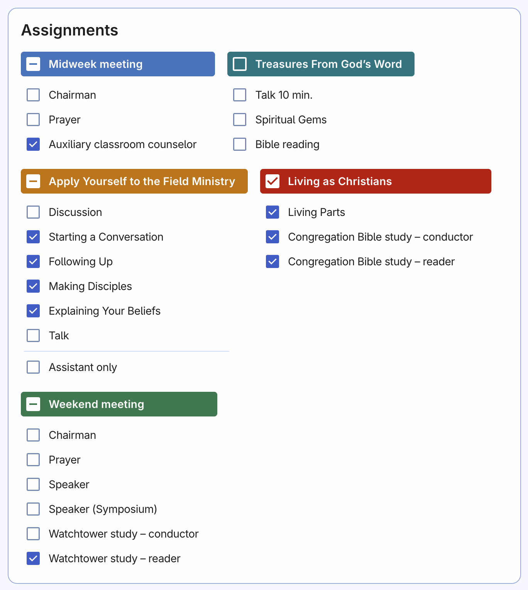
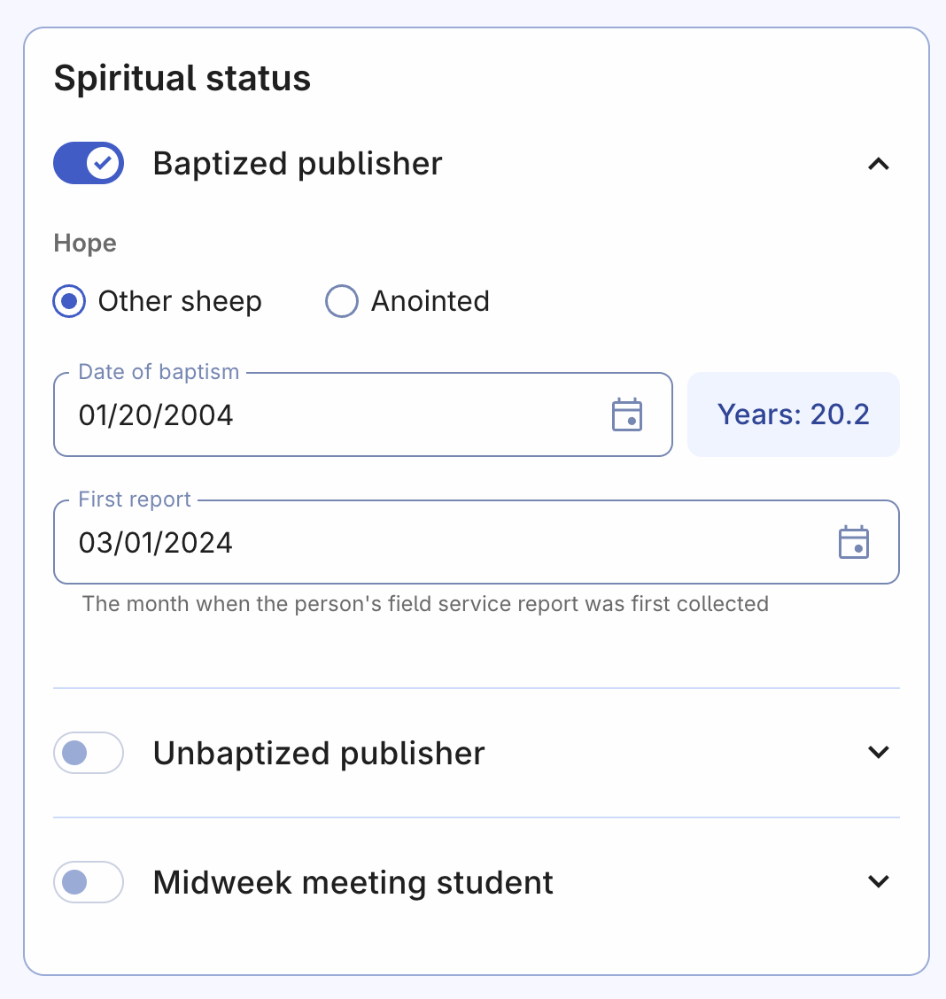
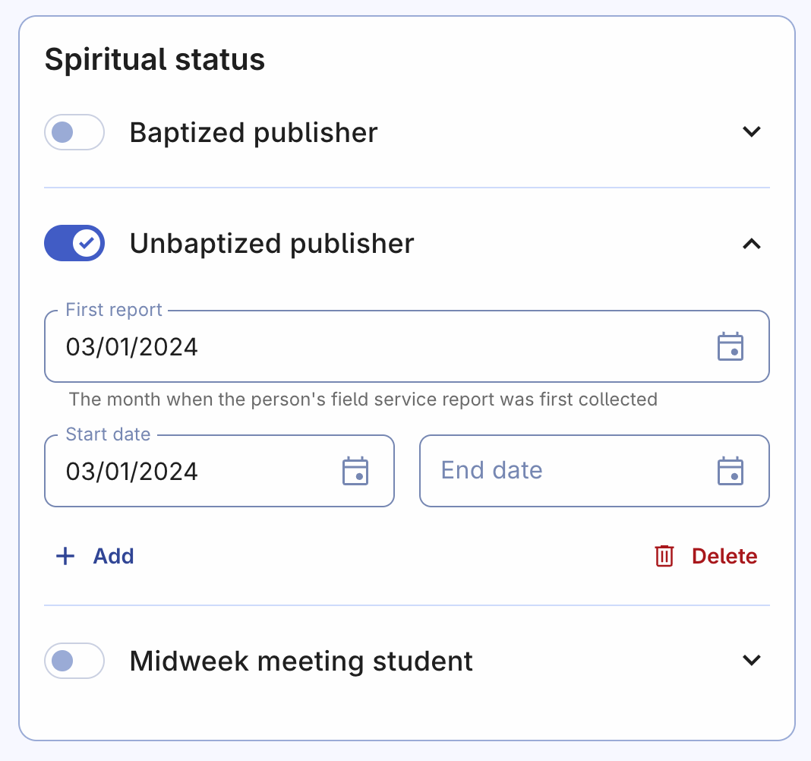
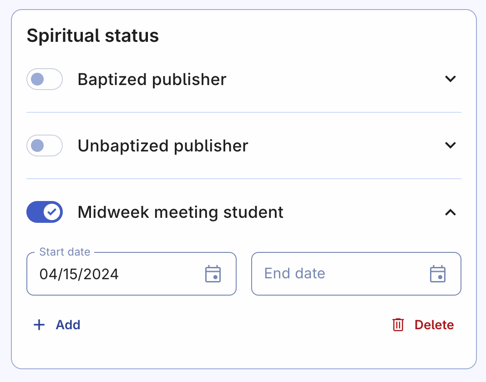
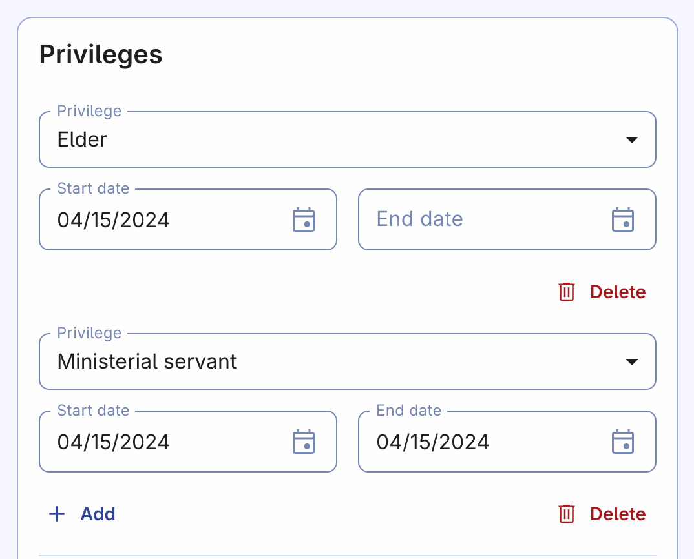
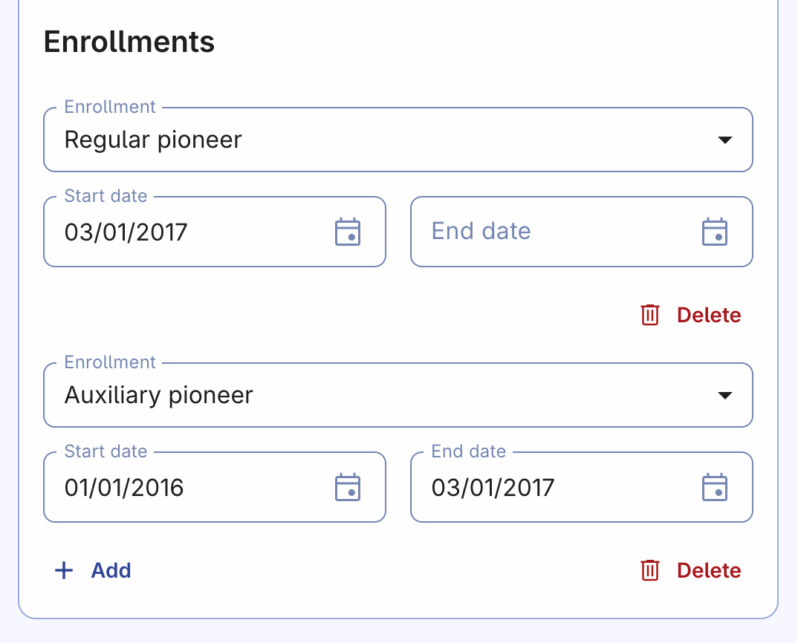
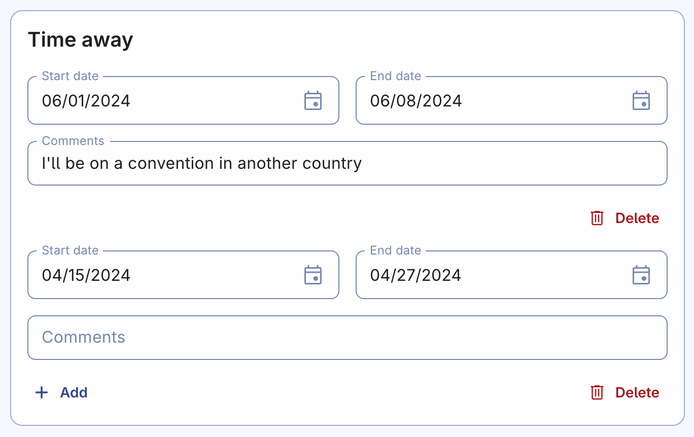
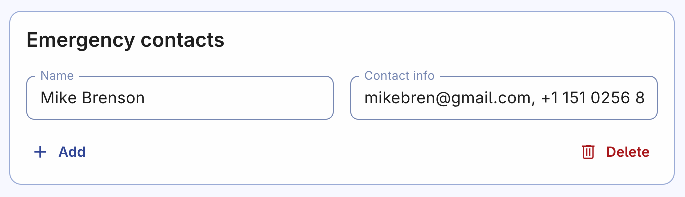

# Add person

The first step after creating a congregation account in Organized – is adding persons. Persons are all people who take part in your congregation's life. That's not only publishers, but also students on a midweek meetings, to allow everybody to view schedules and their assignments.

## Adding persons is important

Adding persons to Organized is important to maintaining accurate and relevant congregation statistics and records. By doing so, you enable the assignment of appropriate meeting parts, keep track of important publisher information such as hope, date of baptism, spiritual status, privileges, and more. Additionally, you can manage time away periods and emergency contacts.

Having all this information in one place provides a single database for all brothers responsible for scheduling, reporting, emergency handling, and other vital tasks in the congregation. This allows you to quickly access any necessary information and even export it using official form templates.

Let's dive deeper into the information you can enter on this page and how it can be useful for your congregation's needs.

## Basic information

- **First and last name:** That's the name of a person, which will be used on schedules, reports, etc.
- **Display name:** It's a shorter form of a name to be used on schedules. For example "Cameron M." instead of "Mike Cameron". You can turn this "Display name" feature on or off on the [Congregation settings](../congregation/congregation-settings) page.
- **Gender:** Either male or female. Note that some assignments, such as student parts, may only be available for sisters.
- **Date of birth:** Enter the date and you will see the automatically calculated person's age.
- **Contact info:** Email address, phone number, and address are needed to keep the contact info up-to-date and be always able to contact a person in case of emergency.

## Assignment qualifications

Customize assignment preferences and qualifications for each person by selecting the appropriate checkboxes. Here are some of meeting parts parameters that usually require some clarifications:

- **Talk 10 min.**: It's a first 10-minute talk on a midweek meeting.
- **Assistant only**: If you select this parameter, the person will be able to get only the assistant role student assignments for the "Apply Yourself to the Field Ministry" part. That applies to both Autofill as well as manual methods of scheduling.
- **Living Parts**: That is a general name for all parts in the "Living as Christians" meeting part. This term is used to describe one or more parts, that always have different titles (unlike Congregation Bible study which is always the same). That's why we need to come up with our own short general name for any "Living as Christians" part.
- **Auxiliary classroom counselor**: Some congregations have only one brother, who is responsible for every meeting's auxiliary classroom parts. Others have a few brothers who take turns. Feel free to select one or more brothers that will have this qualification, this will be helpful especially for cases when one brother is away or sick and he needs a substitution.
- **Speaker (Symposium)**: It's a type of public talk when two speakers have one 30-minute talk split into two halves, so each speaker has a 15-minute talk part. Usually, such method is used for a newly appointed ministerial servant, who has his first talk(s).

## Spiritual status

There are three main options:

1. Baptized publisher
2. Unbaptized publisher
3. Midweek meeting student

### Baptized publisher

Enable this option for every baptized Jehovah's Witness in your congregation and add more specific details such as their hope, date of baptism, and first report submission date. This information is used for submitting congregation reports to your branch office and for exporting forms such as "Publisher records (S-21)".

### Unbaptized publisher

You can add a start and end date for a person's unbaptized publisher status, and even add multiple records if necessary. While it's not required to add the **past unbaptized publisher history** if you're adding a **baptized publisher**, doing so can provide a clear and complete history for future reference.

### Midweek meeting student

This option is for individuals who attend meetings of Jehovah's Witnesses but are not yet unbaptized publishers. Enabling this option will allow the person to view schedules and their assigned student parts by default. You will be able to see their assignment history and edit their qualifications.

## Privileges

You can add congregation privileges for baptized brothers, such as Elder or Ministerial Servant. Click the "Add" button to create a new record and enter the Start date (and End date if applicable). There's no need to delete a privilege record if a brother's stopped serving. Instead, enter the End date to maintain an accurate history of their service. You can add as many records as needed.

## Enrollments

To clarify, the "Enrollments" section refers to the various forms of ministry that a publisher has served in, such as Auxiliary, Regular, Special pioneering, and Field missionary service. To add a new enrollment record, simply click the "Add" button and enter the Start date (and End date if applicable). It's important to keep a record of the publisher's history by entering an End date instead of deleting the record. This way, you can maintain an accurate history of their service. You can add as many enrollment records as necessary.

## Time away

If a person informed you that they will be not available or away during certain periods, you can add one or more "away periods" in their person record. By doing this, responsible for scheduling will be able to take person's unavailability into account when creating new schedules for the dates you've entered.

You can also encourage all Organized users in your congregation to edit their time away by themselves and always keep it up-to-date. You can show them how they can do this from the "My profile" page or share the following short yet informative ["Time away" guide](../my-profile/time-away).

## Emergency contacts

Adding an emergency contact for a person is a great way to ensure that there are additional contacts available in case of an emergency. It's recommended to use the same contacts as listed on the person's "No Blood" document, so that the group overseer and other elders always have the most up-to-date and accurate information on whom to contact in case of an extreme situation.

You can add as many contacts as needed. And in the "Contact info" field you can add different contact methods in the same row, for instance email, mobile phone, or a messaging app @username.

