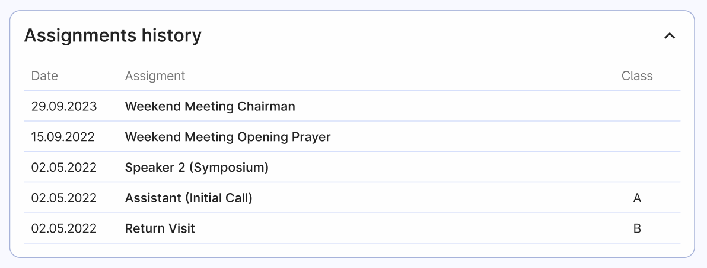

# Edit person details

In Organized, you can add and manage details for each publisher. Editing this information is quite easy, since the page looks exactly like [Add person](./add-person) page. In order to not duplicate the same information on this page, we encourage you to read that page to learn about all the information that can be entered, viewed and edited on Edit person page.

There are still info and actions available only on the Edit person page:

## Assignment history

The main difference between the "**Add** person" and "**Edit** person" pages is that on the "Edit person" page, you can view the assignments history of a person. This is because, at the time of adding a person, they do not have any meeting assignments history to display.

Other than that, you can view and edit all the same info as while adding a person record: Basic info, Assignments, Spiritual status, Enrollments, Privileges, Time away and Emergency contacts.

## Disqualify

This button marks a person as ineligible to receive meeting assignments until they are re-qualified by clicking the "Re-qualify" button on their page. 

:::warning[Please note]
Disqualifying a person is not the same as disfellowshipping them. This feature is used to temporarily disable a person from receiving assignments for a certain period of time.
:::