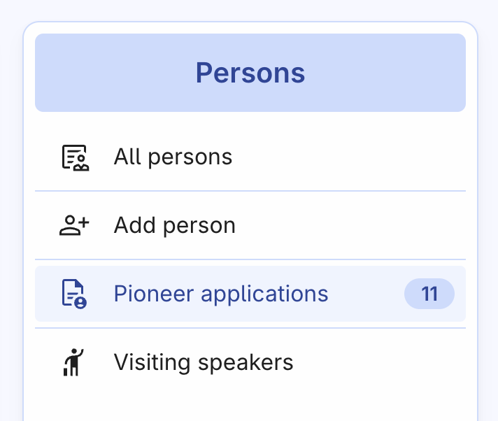
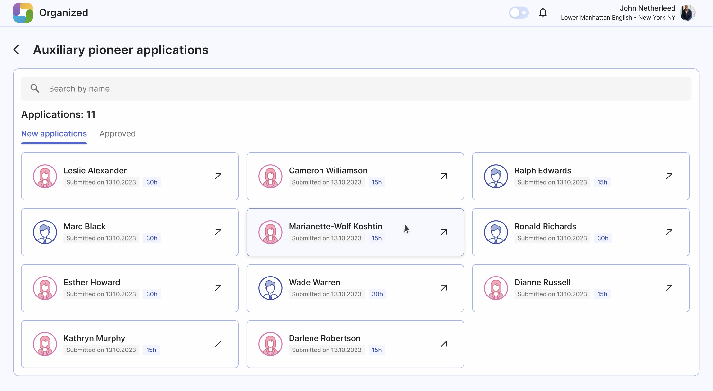
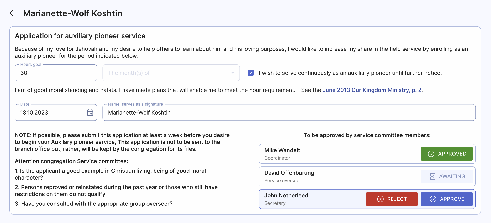
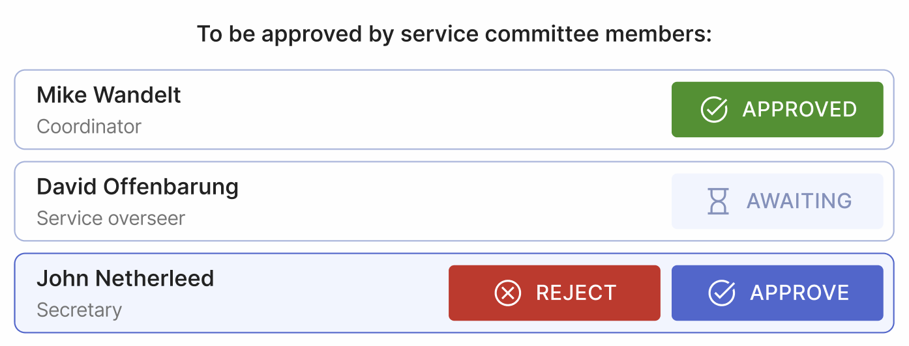
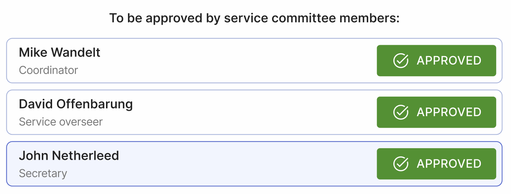

# Reviewing auxiliary pioneer applications

Publishers can [submit auxiliary pioneer applications through Organized](../ministry/auxiliary-pioneer-application), and the congregation's service committee can review them directly in the app.

## View all pending applications

As a member of the service committee, you can see the "Pioneer applications" button with a pending application count badge.

Click on the button to view all applications in more detail, such as the submission date and hour goal of each publisher's application.

## Review an application

Click on a specific auxiliary pioneer application to open and review it. You can see all the information entered by the publisher:

- **Hour goal**: Either 30 hours or 15 hours (_only during announced 'special' months_).
- **Month(s) of service**: Month(s) during which the publisher wants to serve as an auxiliary pioneer. The publisher can also select 'Serve continuously' checkbox to serve until further notice. In this case, the month's selector is not available.
- **Date and signature**: Date of submission and name of the applicant that serves as a signature.

At the bottom of the application, there are 'Approve' buttons for each service committee member. By default, all are in the 'Awaiting' state, but once the brothers make their decisions, the status will change to either 'Approved' or 'Rejected'.

You can make your decision by clicking 'Approve' or 'Reject'. Even after you've made your decision, you can edit it if other brothers haven't yet approved the application.

Once all three brothers approve the application, this person will be marked in Organized as an auxiliary pioneer for the corresponding months or until further notice.

:::note
Please note that Organized won't notify the user if the elders approve or reject the application. Please take care of notifying the publisher according to the theocratic directions.
:::