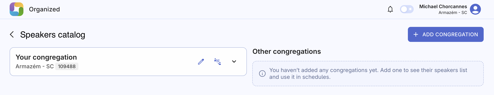
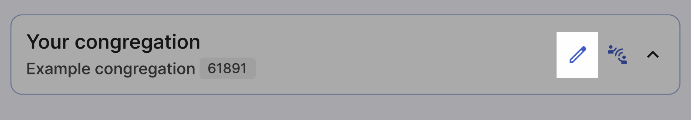

# Visiting speakers

The Visiting Speakers feature is an invaluable tool if you serve as public talk coordinator. It promotes collaboration, offers a greater variety of speakers, and helps distribute the workload among your local speakers. This guide will walk you through how to use this feature effectively.

The page is divided into to sections: Your congregation and Other congregations. Let's see how to set up everything and make the best use of it.

## Your congregation

This section is where you’ll find your outgoing speakers list, their scheduled talks, and some additional useful settings. You can easily expand or collapse this card based on what you need to focus on.

### Congregation name and number

Your congregation’s name and number are automatically added from the registration information you provided. This keeps everything consistent and makes it easier for congregations to identify and connect with each other.

### Congregation visibility in the congregation search

Turn on this setting if you want other congregations to find your congregation when they’re looking for outgoing speakers. With this option enabled, other congregations can search for your congregation by name or number and request to see your speakers list. You’ll need to approve each request before they can view the list.

**Note:** There is no global directory of congregations in Organized. For another congregation to request your speakers list, they need to enter your congregation’s name or number in the search. If your congregation is discoverable, it will show up in their search results. If not, it won’t appear, even if they enter the congregation's complete name.

This feature gives you **full control** over sharing your outgoing speakers list, with a two-step process that ensures access is granted only to those you approve.

### Your outgoing speakers list

If your congregation has approved outgoing speakers and you want to improve collaboration on public talk scheduling with other local congregations, make sure to fill out your outgoing speakers list in Organized. Even if you don’t plan to collaborate directly through the app, keeping this list up-to-date helps you quickly access important information and manage it quickly and effectively as a public talk coordinator.

By turning on the congregation discoverability option, you can further improve digital collaboration with other congregations that are already using Organized.

Here’s how to create and update your congregation's outgoing speakers list to keep the information accurate and useful.

#### Add outgoing speakers

Click the 'Edit' pencil icon at the top right corner of the **Your Congregation** card. 

Once you enter edit mode, you can add new speakers and modify or delete existing ones. Simply click the 'Add Speaker' button, select a speaker from the dropdown list, and then choose the specific talks they are allowed to deliver in other congregations, one by one. Remember, you don’t need to manually enter speaker names here. Just select brothers who already have the [public talk assignment qualification](add-person#assignments) on their Persons page. If a brother isn’t listed, make sure his person record is set up correctly.

Organized aims to always simplify your workflow. The app allows you to not only add public talk titles/numbers but also include songs that each speaker has chosen for their talks! After adding public talks, you’ll be prompted to add songs. Enter one or more songs to save them (or add nothing add click 'Done' if you don't have any). **Having more than one song is always beneficial** in case a Watchtower study song matches one provided by the speaker.

:::tip[Isn't it extra work to collect all the songs for each public talk?]
Adding songs in advance (after requesting them from a speaker) opens up more possibilities for better meeting scheduling! For example, Organized can seamlessly integrate the song into the weekend meeting schedule, bringing peace of mind to the speaker, the meeting conductor, and the audio/video team. The app will even alert the weekend meeting overseer if a song selected by a speaker conflicts with an existing song in the meeting program, preventing duplicates. Even though creating a song list requires some initial effort, it definitely worth it over time and demonstrates your care for all involved in meeting scheduling and conduction.
:::

To view or edit the song list for each speaker, click the 'Songs' button under his name:

 In this window, you will find details about the speaker, including two tabs:
- **Talks and songs**: View all the talks and their corresponding songs. Edit the song list by clicking the 'Edit Songs' button. After adding or removing songs, click 'Done' to finish editing.
- **Contact info**: View the phone number(s) or email address(es) of the selected speaker. Click on the number or email to contact the speaker directly without manually copying the information.

After adding all the necessary information about your outgoing speakers, click the 'Done' checkmark icon in the top right corner. You will then see a quick overview of all your congregation's speakers and their talks.

#### Edit outgoing speakers

Editing speakers and their talks in Organized is just as simple as adding them. Click the 'Edit' pencil icon in the top right corner. Make the changes you need to speakers, their talks, or songs. Use the "Add" or "Delete" buttons to adjust the speakers list. When you’re finished, click the 'Done' checkmark icon in the top right corner to save your changes.

#### View congregations with access to your speakers

Click this icon to see which congregations have access to your speakers list. If needed, you can withdraw access by clicking the delete icon next to a congregation’s name.

## Other congregations

With your outgoing speakers list ready, you can add other congregations. Here’s how to request access to their speakers, talks, songs, and contact details for your meeting schedules. You can also manually add congregations that are not using Organized yet.

### Add congregation

Click the big blue 'Add congregation' button to start. In this window you have two options of what congregation to add:

**- Congregation in Organized:** If the congregation you want to add already uses Organized, great! Enter their country and either their congregation number or name. If they have enabled Organized discoverability, you should find them easily. If you can’t find them, double-check the following: 1. they're registered in Organized, 2. they have an outgoing speakers list, 3. they have turned on the 'Make your congregation discoverable in Organized' setting, 4. there are no typos, or try switching between local language and English, or use the name instead of the number.
**- Add manually:** Manually add a congregation that isn't on Organized yet. Since you can't get all their information automatically, you will have to enter their congregation name, number, circuit number manually. As the next step, fill out additional information about Kingdom Hall address, meeting day, time, as well as necessary contact info, namely public talk coordinator or congregation coordinator.

### View another congregation's speakers

After adding congregations to the 'Other Congregations' list, you can view their outgoing speakers and talks. You can expand or collapse congregation details as needed. There are two types of congregations based on how they were added:

**Congregations using Organized** have a cloud icon next to their name. This means their information is automatically updated with you. You can view their **Speakers** and **Congregation info**, but you can’t edit these details. Click the 'Details' button next to any speaker to see more about their talks, chosen songs, and contact info.

**Manually added congregations** have a semi-transparent crossed cloud icon, indicating no automatic updates. You’ll need to manually update their information if or when needed. Click the 'Edit' pencil icon next to the congregation's name to enter editing mode. Here, you can edit **Speakers** and **Congregation info** by opening a corresponding tab. Editing these details is similar to managing your own speakers list, with the addition of manually adding contact information. After making changes, click the 'Done' checkmark icon at the top right corner of the congregation card to view and double-check the entered information.

## You're all set! 

You’ve done a great job setting up your congregation’s outgoing speakers list and learning how to request speaker lists from other congregations or add them manually. Now you can start scheduling your weekend meetings and include visiting speakers. Just remember to contact the corresponding brothers and check their availability first! 😉

Thanks for following along! If you’re interested in scheduling weekend meetings more effectively, check out [this article](../meetings/weekend-meeting) or explore others that might be helpful. Feel free to share any useful articles with others who might also want to improve their workflow and scheduling experience!