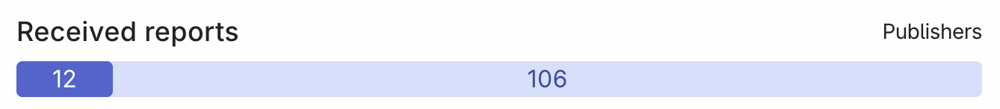
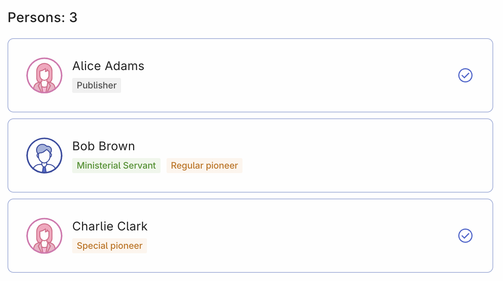
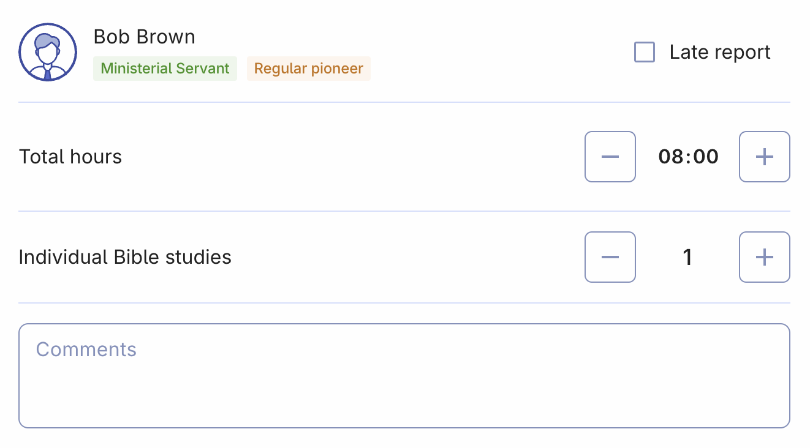

# Field service reports

The Field Service Report page is a centralized hub that combines all the field service reports from publishers in your congregation. This includes reports submitted digitally through the Organized app, as well as those manually entered for publishers who submit their reports using printed form or other methods. By ensuring that all reports are included, this page provides an accurate and comprehensive overview of the congregation’s activity and statistics at a glance.

## Reports filter

The page includes multiple filters, allowing you to select and view reports based on a specific month, year, or publisher category. These filters make it easy to navigate through reports as needed.

### Select specific month

At the top of the page, you can filter reports by service year and month. This feature allows you to focus on the current month to quickly review and add any missing reports. Alternatively, you can look back at historical data to review past reports that have already been entered.

### Filter by publisher category

You can also filter the report list by publisher categories such as active publishers, inactive publishers, baptized publishers, auxiliary pioneers, regular pioneers, and more. Additionally, you can filter based on field service groups or see who has or hasn’t submitted their reports for the selected month. This flexibility lets you easily identify publishers who need to be reminded to submit their reports or whose reports need to be manually entered.

### Received reports progress bar

A visual progress bar on the page shows the number of reports received, starting from zero up to the total number of publishers in your congregation. This makes it easy to see at a glance how many reports have been submitted and how many are still pending, helping you quickly assess how much follow-up work is needed.

## Persons search results

After applying filters such as service year, month, or publisher category, the list of results will update accordingly. This list shows the full names of publishers, their spiritual status (e.g., elder, ministerial servant), and their type of ministry (e.g., pioneer). A checkmark circle next to a publisher's name indicates that their field service report for the selected month has been submitted. If no checkmark is present, it means the report is still pending.

## Report of a specific publisher

To view or add a report for a specific publisher, simply click on their name. This will bring up the detailed report area, where you can enter or edit their monthly field service info. If the publisher is a pioneer, their total hours will be displayed, and of course, you can also record any Bible studies conducted. Additionally, there is a comments section where you or the publisher can add any relevant notes.

### Late reports

Organized makes it easy for secretary to manage late reports. If a report is submitted after the deadline for the branch office, you can mark it as 'late'. Here’s how it works:

- **Marking as late report:** If a report comes in after the deadline, simply mark it as a late submission by clicking the checkbox. 
- **Editing late reports:** Once you mark a month’s report as submitted to the branch office, you won’t be able to edit it. However, you can still edit any reports marked as late.
- **Next month’s report:** Late reports will automatically be included in the next month's report to the branch office.

This feature ensures that even if reports are submitted late, they are still accounted for and included in your reporting.

## Create an S-1 Report

To view all the necessary data for your congregation's S-1 report to the branch office, click the big blue button labeled 'Create S-1 report.' This will redirect you to the Reports to Branch Office page, where you can review and prepare all the information required for submission. Note that this button does not generate or download the report itself but helps you gather all the data needed for sumbitting the official report on JW HUB website.