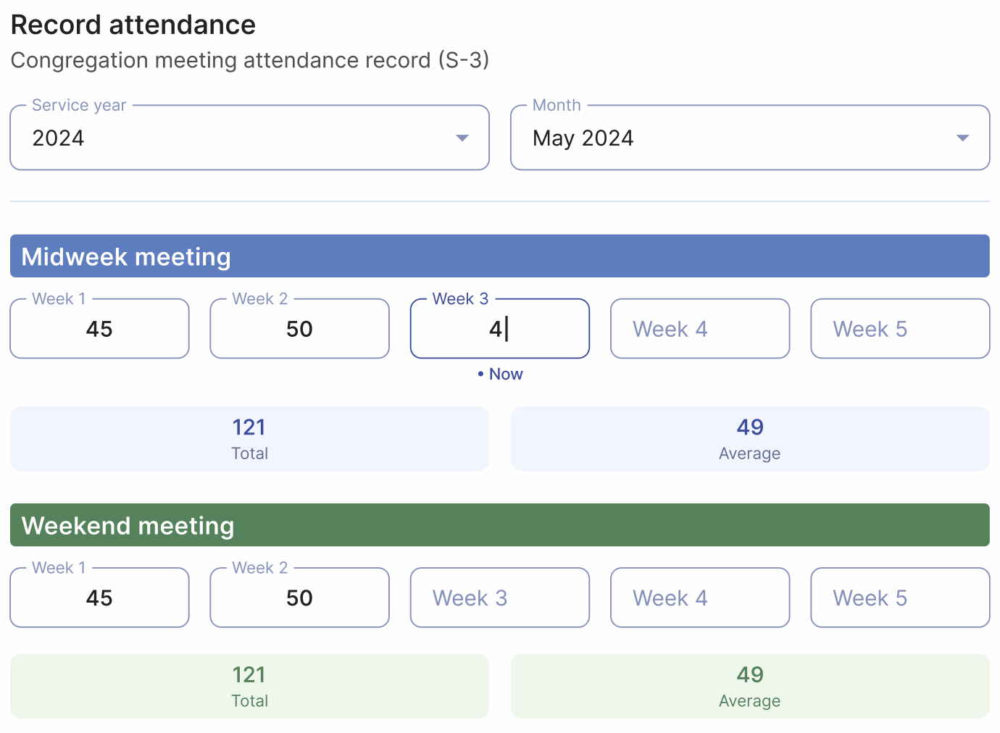
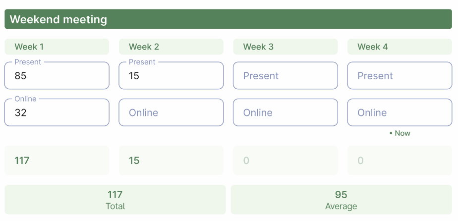

# Meeting attendance record

In Organized, you simply need to enter all the data into the app in a timely manner to get all the reports and statistics when needed (e.g., for a circuit overseer visit or submitting reports to the branch office). The Meeting Attendance Record page is no exception – just enter the attendance count for each meeting, and Organized will automatically save it and include it in the general statistics and report. Let's explore the helpful features and settings available on this page.

## Attendance

The workflow is as simple as it gets. The current service year and month are selected by default, so most of the time you don't need to change it (unless you want to enter past information).

Here, you’ll see areas for Midweek Meeting and Weekend Meeting with fields corresponding to the weeks of the month. There is one midweek meeting and one weekend meeting per week. Select the appropriate field and enter the attendance count for that week. The information will be saved immediately in the field and the monthly history on the right.

:::tip[Useful Tip]
The current week will have the '**• Today**' indicator to help you easily find the current week and ensure you choose the right field. We encourage you to enter attendance records promptly (e.g., during meetings or shortly after) to make the best use of this feature in Organized.
:::

You can see the Total and Average attendance counts under the week input fields. These numbers update dynamically as you enter data, providing a quick overview even before the month ends.

**Please note**: In Organized, you can also record online attendance (e.g. in Zoom) in addition to offline presence in the Kingdom Hall. Although it's not required by Bethel for the S-1 report, your body of elders may find this statistic useful for analysis. To enable this feature, turn on the 'Record online meeting attendance' toggle switch in the Quick settings or on the [Congregation Settings](../congregation/congregation-settings) page. Once enabled, you will have additional fields for recording online attendance and viewing these records in the monthly history. This feature is easy to use, and you can disable it at any time if you choose.

## Monthly history

Here, you can view all the meeting attendance history and statistics that have been entered into the Organized app. Select any month and year you’re interested in, and expand the corresponding month item to view all the details.

Each month includes the following statistics for midweek and weekend meetings:
- Number of meetings conducted
- Total attendance count
- Average attendance per meeting
- Average online attendance *(available only if the 'Record online meeting attendance' setting is turned on)*

## Go to creating S-1 report

All the information on this page is for your records, but it becomes particularly useful when you need to submit the attendance record as part of the S-1 report to your branch office.

Organized makes this easy – as soon as you enter all the attendance records throughout the year, they are automatically saved in your congregation's database, eliminating the need to manually tally the report. It only takes a few seconds for Organized to generate a complete yearly report.

To do this, simply click the 'Create S-1 report'. This button doesn't generate the report itself but redirects you to the [Reports to Branch Office](branch-reports) page, where you can view all the necessary data you need as a secretary to submit the S-1 report.

## Everything is saved, everything is calculated!

Great job! All your records are safely saved, and once the next sync happens, other authorized users will be able to see them too. Organized is here to make keeping track of your congregation’s attendance easy and stress-free!

With features like instant calculations and simple data entry, Organized makes managing attendance a breeze, whether it’s in person or online. Plus, it automatically includes all attendance information in the S-1 report, so you don’t have to spend extra time calculating it.

By using these features, you can reduce your stress and save time, making record-keeping simpler and more enjoyable. We encourage you to take advantage of these tools to make your congregation responsibilities easier!