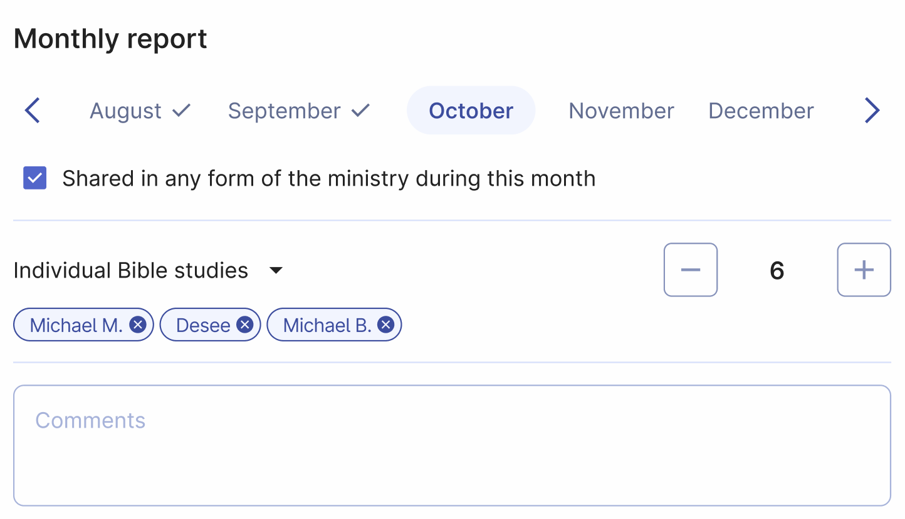
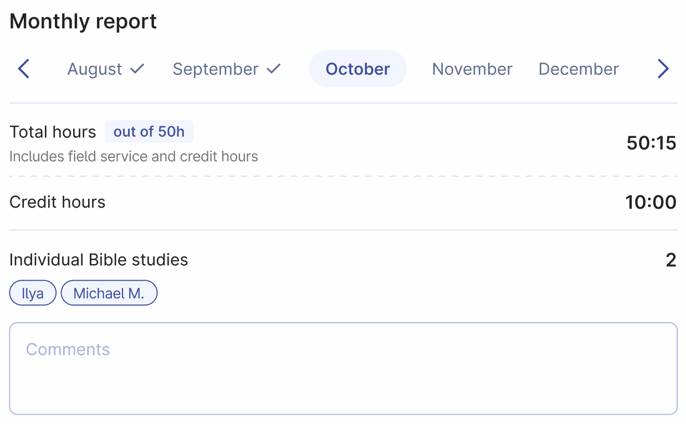

# Report

Welcome to your field service report page. Here, you can quickly open and submit your monthly reports. After submission, your report will be sent to your field service group overseer and congregation secretary.

Easily track your past reports by browsing through the months. You'll find indicators to show whether you've submitted a report for each month.

## For publishers

Submitting your report is simple. Open the page and click on the checkbox labeled 'Shared in any form of the ministry during this month'. After doing this, you can enter the number of individual Bible studies conducted during the month.

You have two options:
- Manually enter the number by clicking the + or - buttons.
- Select Bible studies from your pre-added list. The total number will be calculated automatically. 

:::note
You can add more studies by clicking the + button, but you cannot reduce the count to less than the selected studies from the list. To remove a study from your report, click the remove × icon next to it.
:::

Use the **Comments** field to inform your group overseer and congregation secretary about any special situations that might have impacted your field service.

## For pioneers

Pioneers also need to report their ministry time, and Organized makes this easy while allowing you to manage your ministry records flexibly.

### Daily history

This section displays all your ministry records, including hours and Bible studies. Click on any record to edit it, or click 'Add record' to create a new entry. Select the correct date, and then enter the hours and studies (either from the list or manually).

### Monthly report

:::tip[For pioneers Report page is read-only]
As a pioneer, you can view your monthly report, but you cannot directly adjust your time and Bible studies with + or - buttons. Instead, you need to add or edit **Daily Records**. We recommend using the [Ministry timer](../ministry/ministry-timer) or at least adding your ministry time, credit hours, and Bible studies right after your ministry to keep all the information up-to-date. Then, at the end of the month, submitting your report will be both quick and accurate.
:::

Here you can view your:
- **Total hours**: The number of hours served this month.
- **Ministry goal**: This 'out of ...h' badge includes your monthly goal (15, 30, 50, or 100 hours, depending on your type of pioneer service).
- **Credit hours**: The number of credit hours included in your total hours for this month. This field is visible only if you enabled the [Enable the Credit hours field](../my-profile/personal-preferences#add-credit-field-to-my-report) toggle in your profile settings.
- **Individual Bible studies**: The number of Bible studies conducted. If you have entered studies from your Bible studies list, they will appear as colored badges with the student names. This gives you a quick overview of all studies conducted during the month and lets you adjust the report if needed.
- **Comments**: Enter any comments for the congregation secretary if you need to clarify anything.

## Submit the ministry report

Sending your report is easy! After checking all the details in your report, simply click the 'Submit the report' button. That's it! If you need to make adjustments or fix a mistake, you can undo the submission, make the changes, and then re-submit it. But remember, you can only undo the submission until the secretary marks your report as verified, so make sure to do it quickly.

## The report sent!

You did it, great job! Sending your report on time helps your elders prepare the congregation reports in due time and submit them to the branch office. Thanks for your cooperation, it helps the whole congregation benefit from Organized even more!