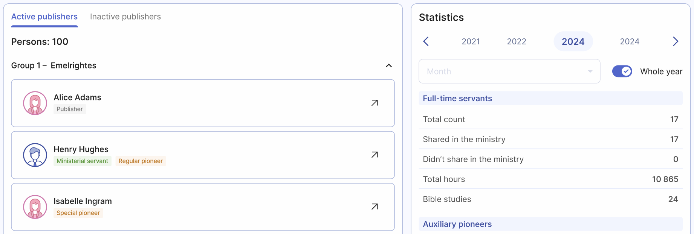

# Publisher records page

The Publisher Records page is your go-to page for an overview of your congregation's publishers. It compiles all the information necessary for branch reports, neatly organized into categories such as publishers, auxiliary pioneers, full-time pioneers, and more. 

Organized provides flexibility when it comes to managing your data. If you need a printed copy of a publisher's record, you can easily export it into the S-21 form format. This ensures that you're never locked into the application, giving you the freedom to handle your records as needed.

## Publisher records by group
The page also lists all publisher records, sorted by their respective field service groups. Within each group, you'll find an organized list of publishers. By selecting a publisher, you can view their personal monthly history, which is displayed according to the service year you select.

When you view a specific publisher's record by clicking on them, you'll find all the information included in the printed S-21 form, such as the publisher's date of birth and baptism. Organized takes this a step further by automatically calculating and displaying the publisher's age, as well as how many years they have been baptized. These features make it easier to keep track of this information without needing to calculate it manually.

## Congregation statistics at a glance

On this page, you'll find the total statistics for your entire congregation. This includes everything needed for official branch reports, plus additional statistics broken down into relevant categories. Whether you're tracking the progress of publishers, pioneers, or other groups, the Publisher Records page provides a clear and detailed summary.

You can view the statistics sorted by your desired month, or use the 'Whole year' toggle switch to see the annual stats for the entire service year for your congregation.

:::note[Publisher records page only displays existing data]
It’s important to note that the Publisher Records page aggregates statistics from various parts of the application, meaning you can't edit the data directly there. To ensure accuracy, make sure to enter publisher service reports timely and regularly, while always keeping their personal information up-to-date. Doing so means that when it’s time to submit a report or export a publisher's record, you can do so with just a few clicks.
:::

With Organized, managing your congregation’s data is not just easy — it’s efficient and thorough, helping you with all your needs.
