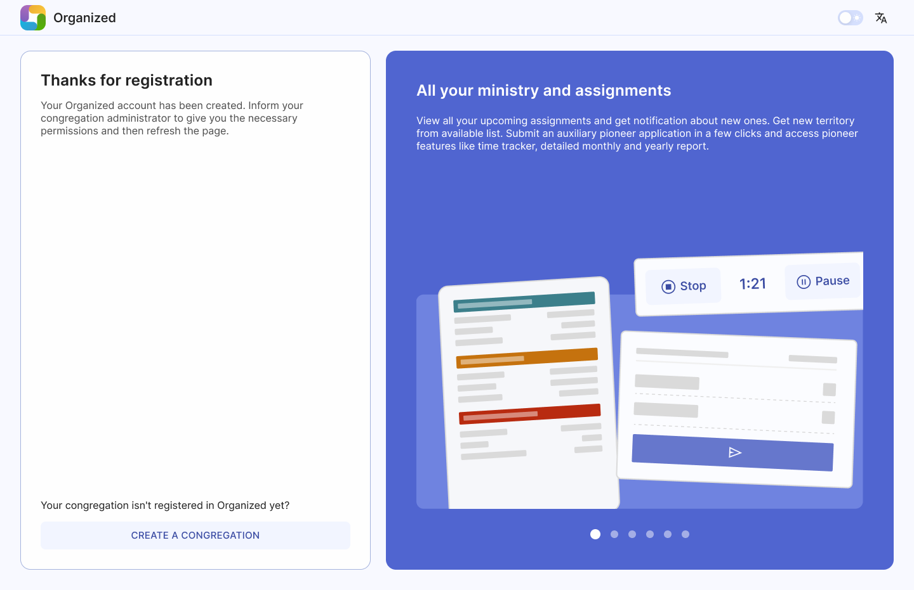
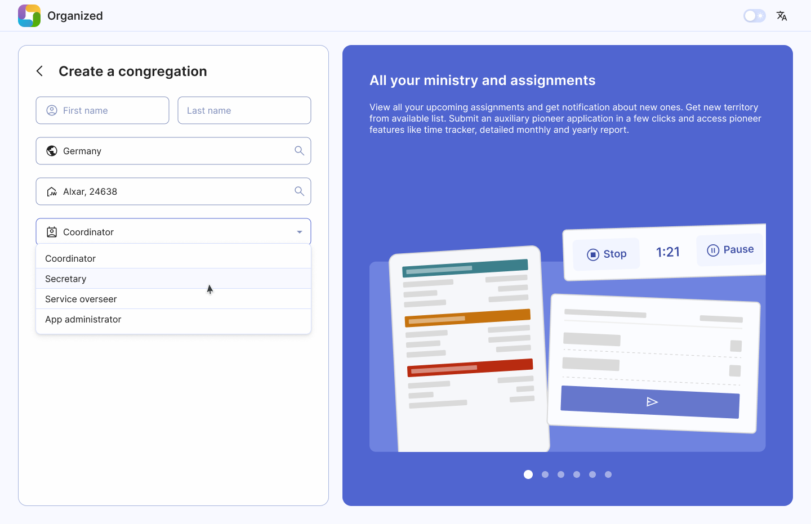
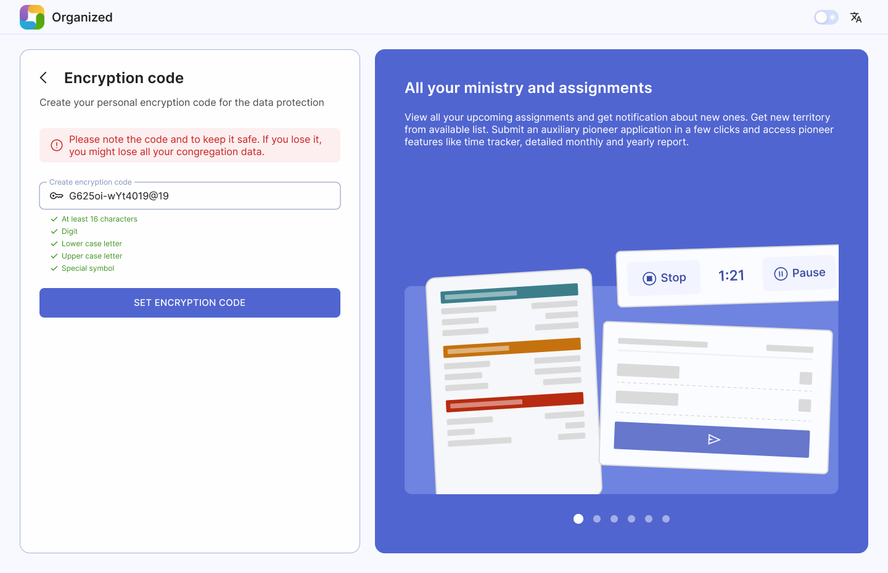

# Create your congregation

If your congregation doesn't use Organized yet, start by registering as a "Baptized brother".

:::tip[Please, be aware]
Please, ensure elders of your congregation approve Organized app usage before proceeding.
:::

## Create your congregation

After completing the registration, click on the "Create Congregation" button at the bottom of the page. 

## Enter details

After doing so, enter your congregation’s details in corresponding fields. Congregation name and number is fetched directly from jw.org.

### Set up an encryption code.

This code safeguards your congregation's info. This code should be strong, but without too tricky symbols. Remember that publishers should be able to enter this code on their devices as well. Please, avoid using widely known or obvious numbers and words like _1914_, _144000_, _bestlifeever_ or _Organized_. You can see an example of a srong code on the image below.

:::danger[Encryption code is very important]
**If you lose this code, all congregation data will be lost**, and you'll need to start all over again. Note it and keep it safe! Notify brothers and sisters to not share it with others. Keeping your congregation info secure is a joint goal and responsibility of all users.
:::

### Your congregation is created!

Done! Once set up, you will land on your congregation's page as the admin. From here, you can add members, assign roles like coordinator or secretary, and grant specific rights, such as editing schedules and others. Explore other guide articles to learn how to do that.