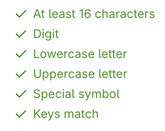

# Create your congregation

If your congregation doesn't use Organized yet, start by registering as a "Baptized brother".

:::info[Please, be aware]
Please, ensure elders of your congregation approve Organized app usage before proceeding.
:::

## Create your congregation

After completing the registration, click on the "Create Congregation" button at the bottom of the page. 

## Select your congregation

Enter your personal and congregation’s details in corresponding fields. Congregation name and number is fetched directly from jw.org. Make sure to enter at least two characters for the search to start working. If you can't find your congregation in the search field, or it is not even listed on the jw.org congregation search page, please contact our [support email](mailto:support@organized-app.com) for further assistance.

### Create a Congregation master key

This master key protects your congregation's information. It's required for anyone working with congregation data, scheduling, and managing the congregation account. Please avoid using easily guessed or common numbers and phrases, such as _1914_, _1qaz2wsx_, _144000_, _bestlifeever_ or _Organized_. The code can consist of readable words or random characters, depending on the technical proficiency and preferences of your congregation’s elders and ministerial servants who will be using the app. Consider their readiness and 'comfort level' when choosing the format.

Organized has many strong security features, but keeping your congregation's data safe also depends on each user being careful and responsible. By staying alert and using good practices while sharing the code with other authorized brothers, you help keep everyone's information secure.

:::danger[Master key is crucial]
**If you lose this code, all congregation data will be lost**, and you'll need to start all over again. Note it and keep it safe! Notify others to not share it with persons, who are not authorized by your elders. Keeping your congregation info secure is a joint goal and responsibility of all users.
:::

#### Principles for creating a secure master key:

- **Complexity**: The master key should be longer and include a mix of letters, numbers, and special characters.
- **Strong security**: It must be strong and difficult to guess, reflecting its critical role in securing administrative access.
- **Confidentiality**: Only share the master key with authorized, trustworthy brothers to maintain its security.

### Create a Congregation access code

The access code allows app users to connect to your congregation in Organized and must be entered each time they log in to prevent unauthorized access. While this code can be shorter and less complex than the master key, avoid using overly generic or obvious words.

Since many people in your congregation will know this code, advise new users not to share it personally. Instead, they should ask the elders or the Organized app administrator for it. Although having the congregation access code alone won't grant unauthorized access, it's essential to remain cautious about codes, PINs, keys, and other security measures.

You can change the congregation access code in the settings later. However, remember that changing the access code means you need to notify all active users so they can later log in to their accounts without any troubles.

#### Principles for creating a good access code:

- **Simplicity and ease of use**: The access code should be relatively easy for users to enter but not so obvious that it becomes a security risk.
- **Avoid widely known phrases**: Use a meaningful combination of words and numbers that are not easily guessable.
- **Keep the code secure and users informed**: Even though the access code is easier to remember and enter, it should still be unique and not easily guessed. Remind users to not share the code personally, but always request it from Organized app administrator in your congregation.

### Your congregation is created!

Well done! Once everything is set up, you’ll land on your congregation’s page as the admin. From here, you can complete the initial basic congregation preferences setup, create your own person record. After that, let’s explore the app together and uncover all its features!

### What to do next?

It’s time to set up your congregation, including person records, new users, and meeting materials imports, to ensure everything is ready for the congregation to benefit from Organized.

For you to simplify this path, we prepared the [Recommended congregation setup steps guide](../onboarding/setup-order), which you can follow to make the setup process smooth and flawless.

Be sure to explore our other guide articles to discover how to fully utilize all the features and capabilities of the app!