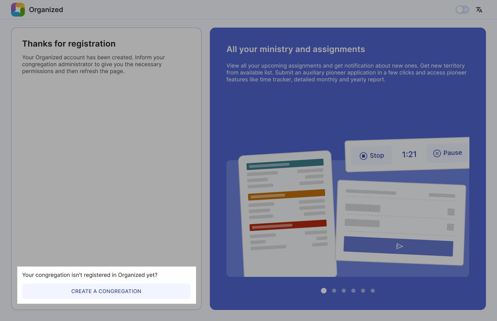

# Create your congregation

If your congregation doesn't use Organized yet, start by registering as a "Baptized brother".

:::tip[Please, be aware]
Please, ensure elders of your congregation approve Organized app usage before proceeding.
:::

## Create your congregation

After completing the registration, click on the "Create Congregation" button at the bottom of the page. 

## Enter details

After doing so, enter your congregation’s details in corresponding fields. Congregation name and number is fetched directly from jw.org. Make sure to write at least two characters for the search to start working. If you can't find your congregation in the search field, or it is not even listed on the jw.org congregation search page, please contact our [support email](mailto:support@organized-app.com) for further assistance.

3### Set up a Congregation master key

This code safeguards your congregation's info. Please avoid using widely known or obvious numbers and words like _1914_, _144000_, _bestlifeever_ or _Organized_. You can see an example of a strong code on the image below.

:::danger[Encryption code is very important]
**If you lose this code, all congregation data will be lost**, and you'll need to start all over again. Note it and keep it safe! Notify brothers and sisters to not share it with others. Keeping your congregation info secure is a joint goal and responsibility of all users.
:::

### Create a Congregation master key

This master key protects your congregation's information. It's required for anyone working with congregation data, scheduling, and managing the congregation account. Please avoid using easily guessed or common numbers and phrases, such as _1914_, _144000_, _bestlifeever_ or _Organized_. You can see an example of a strong code on the image below. 

Organized has strong security features, but keeping your congregation's data safe also depends on each user being careful and responsible. By staying alert and using good practices, you help keep everyone's information secure.

:::danger[Encryption code is very important]
**If you lose this code, all congregation data will be lost**, and you'll need to start all over again. Note it and keep it safe! Notify brothers and sisters to not share it with others. Keeping your congregation info secure is a joint goal and responsibility of all users.
:::

### Create a Congregation access code

The access code allows app users to connect to your congregation in Organized and must be entered each time they log in to prevent unauthorized access. While this code can be shorter and less complex than the master key, avoid using overly generic or obvious words.

Since many people in your congregation will know this code, advise new users not to share it personally. Instead, they should ask the elders or the Organized app administrator for it. Although having the congregation access code alone won't grant unauthorized access, it's essential to remain cautious about codes, PINs, keys, and other security measures.

You can change the congregation access code in the settings later. However, remember that changing the access code means you need to notify all active users so they can later log in to their accounts without any troubles.

### Your congregation is created!

Done! Once everything is set up, you will land on your congregation's page as the admin. From here, you can add members, assign roles like coordinator or secretary, and grant specific rights, such as editing schedules and others. Explore other guide articles to learn how to add all required congregation details, invite users to your congergation in Organized, create schedules and so much more!