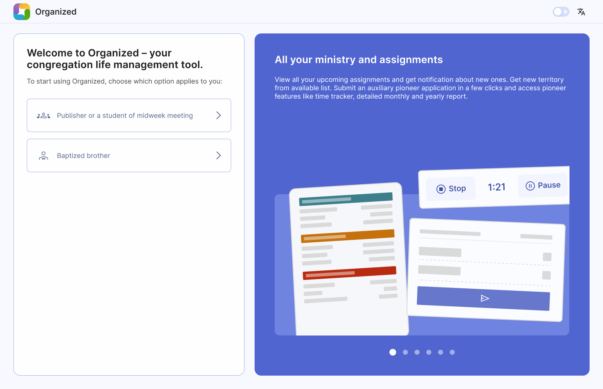
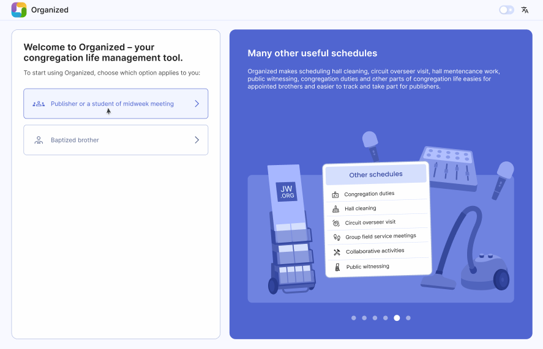
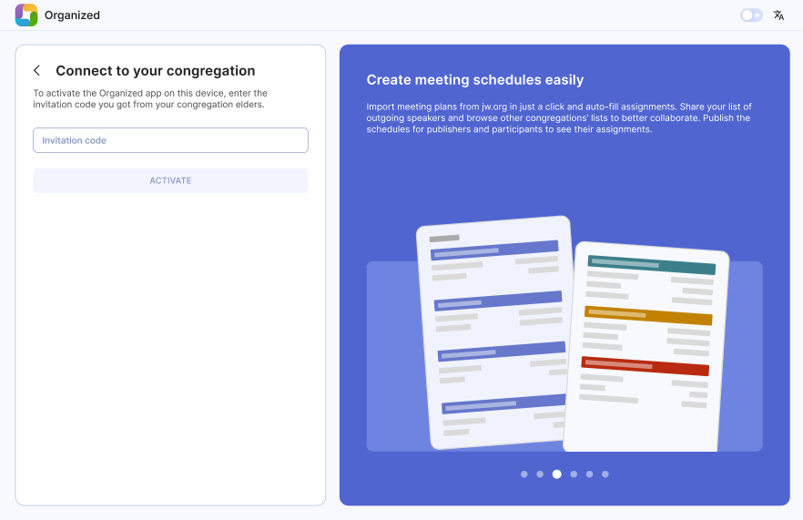
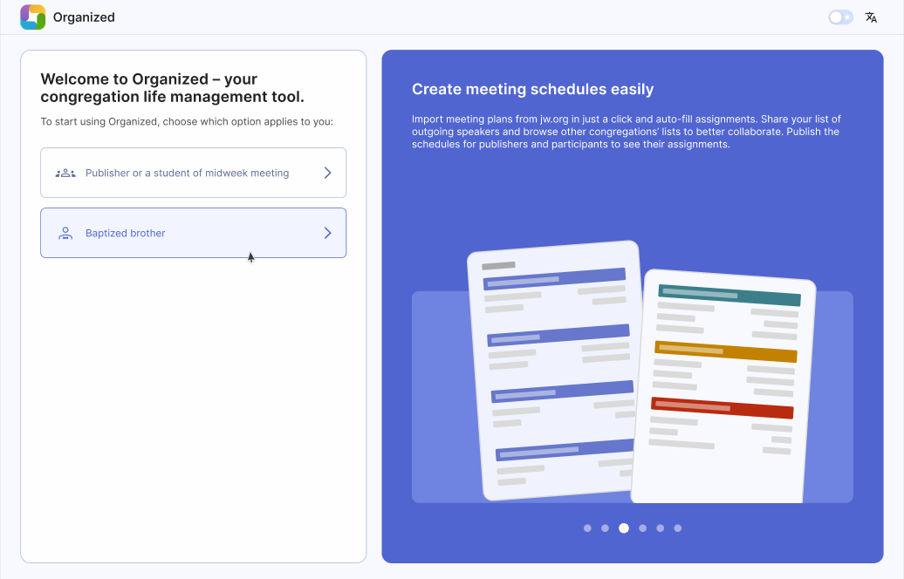
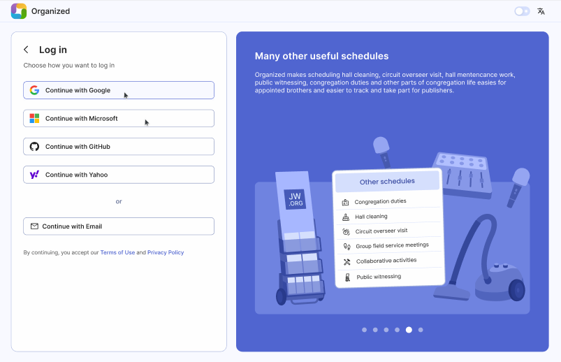

# Register and join congregation

Once you open the [Organized app](https://organized-app.com/), you need to log in to your account. If you don’t have an account yet – registration process is identical to the sign-in process. When you follow the steps below, your account will be automatically created. 

:::tip[There are two ways to log in to the Organized app:]
1. As a **publisher or a midweek student**.
2. As a **baptized brother**.
:::

Here you need to select an option that suits your main current congregation role.

## Option 1: Log in as a publisher or a midweek meeting student

Click the "Publisher or student midweek meeting" button. This option is for: 
- Baptized sisters, 
- Unbaptized brothers and sisters,
- Persons who have assignment on midweek meetings.

### Connect to your congregation

After selecting this option, you need to connect to your congregation. You can ask the Organized administrator in your congregation for the code. 

:::tip[Please, remember]
Once you connect to the congregation, Organized app will remember your device ID and will associate this device with your account. 
:::

### Enter your invitation code

Ask your elders or the Organized administrator in your congregation for your personal invitation code. After you have entered the code, click on the “Activate” button. If you get an error, double-check the code or see the error message details.

If everything is done correctly, you will be redirected to the home page dashboard with all the features available for you, like meetings schedules, upcoming assignments, reports, etc. Well done!

## Option 2: Log in as a Baptized brother

First, you have to register your personal account in Organized, which administrator will later add to your congregation. To do this, click the "Baptized brother" button. This option is for all baptized brothers, including: 
- Baptized brothers, that don’t have any responsibilities yet (but might have in the future), 
- Baptized brothers, that have responsibilities (e.g., help with territories, filling out forms, etc.),
- Ministerial servants,
- Elders.

### Read and accept the terms

After selecting “Baptized brother” option, you will see this important message about how the Organized app works and keeps your data safe. Please read it so you understand it and even can explain it to others. That's not just a legal text, it explains how the app works and how it securely handles all the data. Once ready, select the checkbox below and click “Next”.

### Select your login method

Now select how you'd like to log in to Organized. Remember your choice for next time, so you can access your existing account instead of making a new one.

**Alternative:** If you don’t have any account of listed login providers, you can log in with your email address. Just select “Continue with Email” option and and follow the short and simple instructions: 1. Request the authentication code to your email address, 2. Open the link from the received message, 3. Click "Log in" button in the app.

### Request adjustments of your rights

Well done! Now your personal 'Baptized brother' account is now created! You just need to:
1. Inform your congregation’s Organized administrator that you've already registered in the app.
2. Provide him your email address that you used for account registration.
3. Wait until he assigns you all the necessarry roles and rights.

### Login once again

Once the steps above are done, reload the page to login once again. You might be prompted to enter your congregation’s access code and/or Congregation master key, depending on your user role and rights. You can request those codes from the brother who is serving as the app administrator in your congregation. 

**Congregation access code:** is a code created by elders to ensure the strong security of the app. Please don’t share the code with others, but encourage them to request the code directly by elders.
**Congregation master key:** this key is required by those handling administrative and scheduling tasks in Organized. If you’re asked for it, contact your congregation’s Organized administrator to obtain the Master key. Always keep it secure and confidential, as it is crucial for your congregation's Organized account!

#### Afterward, so you can open the Organized app and start using it!

Now you have access to the app, congratulations! Explore the home page dashboard and all the features that Organized has!
