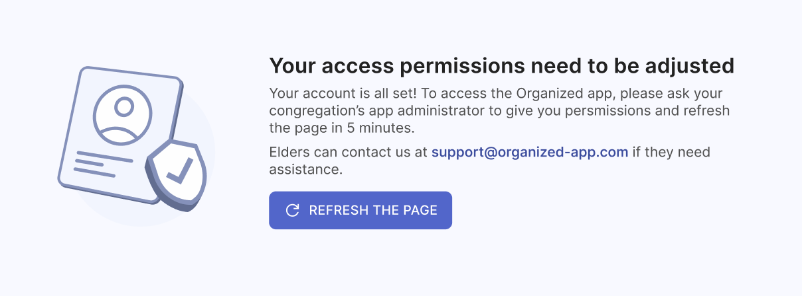
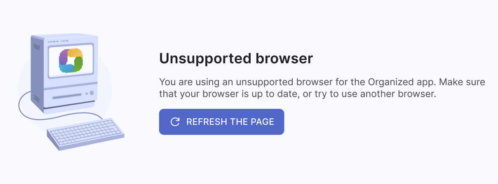
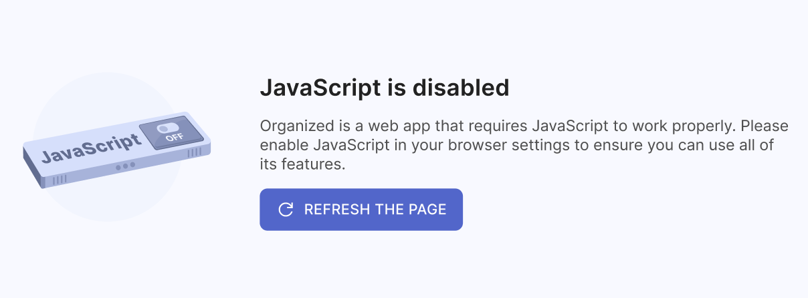

# Common errors and solutions

There are some errors that users are facing the most often. Now we will review them and show how to fix them.

## Your access permissions need to be adjusted

Don't worry, this is not an error, but rather a normal part of the registration process. Your access permissions need to be adjusted by your congregation's Organized app administrator. After you create your account, the administrator will need to assign you the correct role and set of rights. 

Once this is done, you'll be able to access your account. Please reload the page in approximately 5 minutes after the administrator has granted you the appropriate rights, and then start using the app!

## No schedules have been published yet

This means that the schedules are still being prepared by the responsible brothers. Once they are published, you will be able to see them in the app. Please be patient and check back later for updates. 

It's also possible that the brothers are still working on them, or they may have forgotten to click 'Publish'. Try checking with them to see if the schedules are ready. Once they are published, you will be able to view them right away!

## Unsupported browser

You might be using using an unsupported browser or very outdated version. Please check if your browser is up to date, or try to use another browser to see if this solves your problem.

## JavaScript is disabled

This error occurs if you are using a browser with JavaScript disabled. Organized is a modern web application that relies on JavaScript to function properly. JavaScript is a programming language that allows web apps to interact with users, update and change content dynamically, and respond to user actions.

To use the Organized app, please enable JavaScript in your browser settings or consider using a different browser specifically for accessing the Organized app. Enabling JavaScript will allow the app to function properly and provide you with the best user experience.
