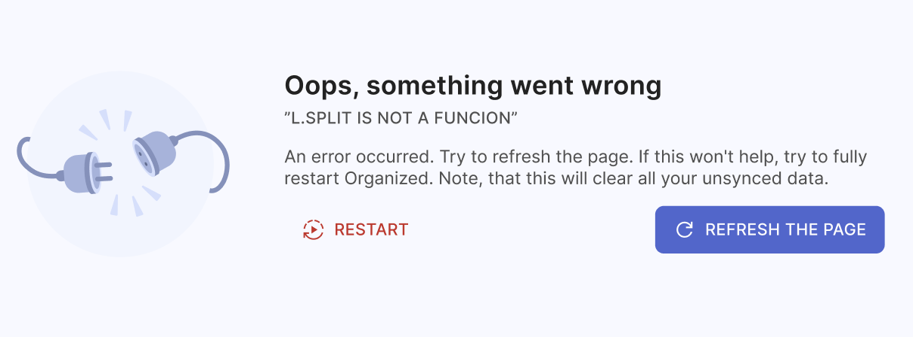

# Common errors and solutions

There are some errors that users are facing the most often. Now we will review them and show how to fix them.

## Oops, something went wrong

This error can appear because of different temporary issues with app's functionality. Try to refresh the page first (a few times if needed). If this won't help, click "Restart" button to fully restart Organized.

If nothing helped, please make a screenshot or note the error code (right under the "Oops, something went wrong" title) and contact Organized support at [support@organized-app.com](mailto:support@organized-app.com) describing your issue. 

## Unsupported browser

You might be using using an unsupported browser or very outdated version. Please check if your browser is up to date, or try to use another browser to see if this solves your problem.

## Please enable JavaScript

This error occurs if you are using a browser with JavaScript disabled. Organized is a modern web application that relies on JavaScript to function properly. JavaScript is a programming language that allows web apps to interact with users, update and change content dynamically, and respond to user actions.

To use the Organized app, please enable JavaScript in your browser settings or consider using a different browser specifically for accessing the Organized app. Enabling JavaScript will allow the app to function properly and provide you with the best user experience.