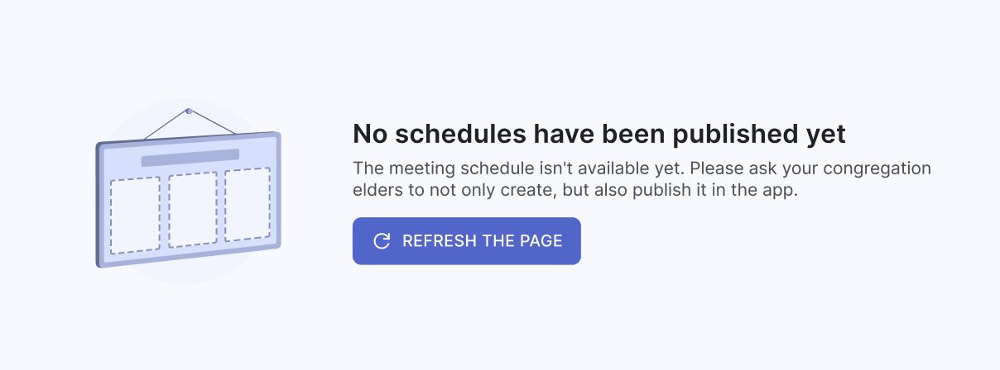
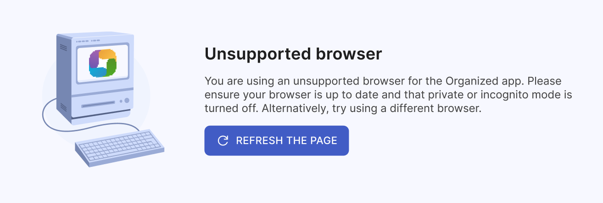

# Common errors and solutions

There are some errors that users are facing the most often. Now we will review them and show how to fix them.

## Your access permissions need to be adjusted

Don't worry, this is not an error, but rather a normal part of the registration process. Your access permissions need to be adjusted by your congregation's Organized app administrator. After you create your account, the administrator will need to assign you the correct role and set of rights. 

Once this is done, you'll be able to access your account. Please reload the page in approximately 5 minutes after the administrator has granted you the appropriate rights, and then start using the app!

## No schedules have been published yet

This means that the schedules are still being prepared by the responsible brothers. Once they are published, you will be able to see them in the app. Please be patient and check back later for updates. 

## Unsupported browser

You might be using an unsupported browser or a very outdated version. Please check if your browser is up-to-date, or try using another browser to see if this solves your problem.

Also, be aware that private or incognito modes can prevent the app from locally storing necessary data. The Organized app needs to store some data in your browser to work properly, and private modes prevent this. For example, Private mode in Firefox or Incognito mode in Chromium-based browsers may not let Organized save the data on your device, making it impossible for the app to function.

:::note
_"Saving your congregation data"_ doesn't mean that Organized team can somehow access your data. Organized has to save essential information that you enter into your device's browser and store and store it inside your browser without sending any data outside. This data is only used for you to have all your congregation info, schedules, and assignments, share with others within your congregation, and to keep the app running smoothly. **All your congregation data is safe and is not shared with anyone else.**
:::

## JavaScript is disabled

This error occurs if you are using a browser with JavaScript disabled. Organized is a modern web application that relies on JavaScript to function properly. JavaScript is a programming language that allows web apps to interact with users, update and change content dynamically, and respond to user actions.

To use the Organized app, please enable JavaScript in your browser settings or consider using a different browser specifically for accessing the Organized app. Enabling JavaScript will allow the app to function properly and provide you with the best user experience.

## Do you have other questions?

If you’ve gone through this user guide and our frequently asked questions but still can’t find the answer you’re looking for, don’t hesitate to reach out! We’re here to help. Just start a new [Discussion on our GitHub page](https://github.com/sws2apps/organized-app/discussions), and we’ll do our best to assist you. We’d love to hear from you!