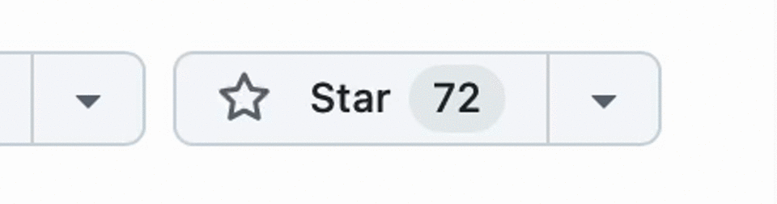

# Star and subscribe

## Star the GitHub project

One of the easiest ways to show your support for the Organized app and help it gain more visibility is to star the [Organized repository on GitHub](https://github.com/sws2apps/organized-app). To support, simply click the star icon ⭐️ in the top-right corner of the repository's main page. By starring the repository, you'll make it easier for other enthusiastic publishers and developers on GitHub to discover and contribute to the project. This small action can have a significant impact on the growth and improvement of the Organized app.

## Subscribe to our YouTube channel

Another way to support the Organized app is to subscribe to [Organized YouTube channel](https://www.youtube.com/@organized-app). By subscribing, you'll be notified of our latest video releases, including tutorials, feature updates, useful tips and other helpful content. This will help you stay up-to-date with the latest developments in the Organized app, and it will also help Organized reach a wider audience of brothers and sisters, who can also benefit from using the Organized app.

In addition to subscribing, you can also support us on YouTube by sharing our videos with others who may find them helpful and liking our videos to make them easier to find by others.

