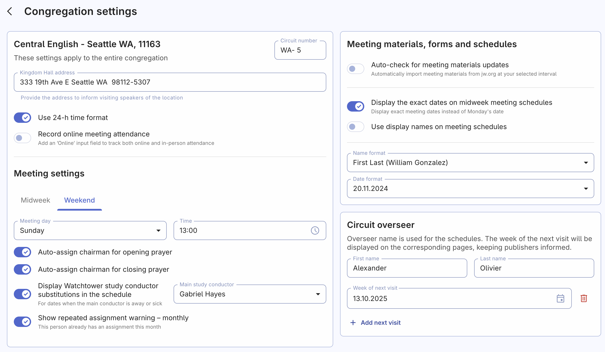

# Congregation settings

The Congregation Settings page is your central admin panel where all the settings from across the Organized app come together. While different pages have their own Quick settings, this page gives you an overview of everything at a glance. This makes it easy to see and manage all the settings for your congregation in one place.

However, keep in mind that any changes made here will apply to all users of the Organized app, as well as to schedules, date/time/name formats within the app. Not all users have full access to edit these settings, but it’s still important to communicate with other appointed brothers before making key changes.

Here’s what you can edit on this page:

## Congregation details

Enter your congregation’s address, circuit number, toggle online attendance recording, set your preferred time format, and other settings.

## Meeting settings

Here, you can find and adjust all the details about your meeting dates, times, and some other congregation's preferences. Let’s explore some of the key options you can edit:

### Midweek meetings

- **Meeting day and time:** Select the correct day of the week and starting time for the meeting, and remember to keep it up-to-date if any changes occur.
- **Auto-assign chairman for opening/closing prayers**: When this option is enabled, the prayer field(s) for the respective meeting will be hidden from the scheduling page, and the chairman will be automatically assigned.
- **Auxiliary classroom**: Specify whether your congregation uses an auxiliary classroom.
- **Assign main auxiliary classroom counselor**: Select a brother to always serve as a counselor. Ensure this brother has [corresponding assignment qualification on their Person page](../persons/add-person#assignment-qualifications). You can still assign other counselors either manually or let Autofill rotate them by not selecting a main counselor.

### Weekend meetings

- **Meeting day and time:** Select the correct day of the week and starting time for the meeting, and remember to keep it up-to-date if any changes occur.
- **Auto-assign chairman for opening prayer**: When this option is enabled, the prayer field for the respective meeting will be hidden from the scheduling page, and the chairman will be automatically assigned.
- **Appoint a substitution for visiting speakers**: Assign a backup speaker from your congregation for the case that the visiting speaker unexpectedly can't deliver the talk.
- **Display Watchtower study conductor substitutions in the schedule**: Typically, only one conductor is appointed as the Watchtower study conductor. However, if a substitute is needed, they will be listed in the printed schedule so they can be prepared well in advance.
- **Show repeated assignment warning – monthly**: Enable this setting to see warnings if a person is assigned multiple times in the same month (by default, Organized warns only about repeated assignment within the week).

## Congregation privacy

Control who can see time away and outgoing speaker schedules — either all users or only appointed brothers. You can also manage your congregation’s unique access code, which is crucial for data security. This code allows both new and existing users to connect or log in and is used to encrypt congregation data for all members.

:::warning[Please, note]
Even though changing the congregation access code is straightforward, we recommend not doing this frequently. Once you change the code, neither new nor existing users will be able to log in with the old code and will need to be informed of the new one. When communicating the updated code, ensure it remains confidential. Advise users not to share the code and to reach out to the elders if they need assistance. While Organized takes extensive measures to secure data, remember that protecting this information is a collective responsibility.
:::

## Meeting materials, forms, and schedules preferences

Customize how often the app checks for updates to meeting materials and adjust display preferences like showing short names (e.g., Mike S. instead of Mike Stevens) in schedules or using specific date or name formats preferred in your area.

## Circuit overseer

Enter your overseer’s name and the dates of his next visits. This information will be used in schedules to help with better and more accurate scheduling.

## More to come

As Organized develops and new features are added, settings for them will appear on this page. Keep an eye on update notes to make the most of the app’s new capabilities. Stay tuned for more ways to fine-tune your congregation’s experience with Organized!