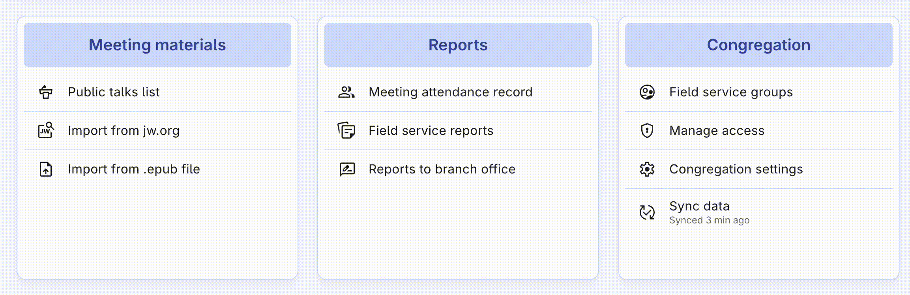

# Import from jw.org

Importing meeting materials from jw.org is simple and fast with Organized! On the "Meeting material" card, click the **Import from jw.org** button. The import will be completed in a few seconds.

The imported meeting materials language matches your [Congregation settings](../congregation/congregation-settings.md) import language setting. So, if you're getting wrong language materials imported, please check out the settings on that page.
