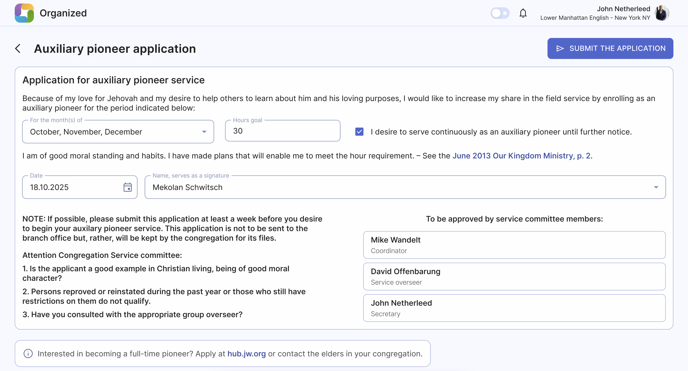
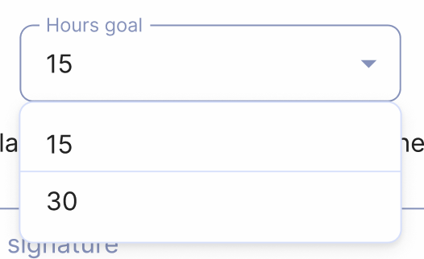

# Submit auxiliary pioneer application

You can submit an auxiliary pioneer application right in the Organized app and your elders will review it. To do this, click the 'Auxiliary pioneer application' button located at 'Ministry' card on the home page.

The application form repeats the text and required fields of the official form.

## Carefully read all the information

Before submitting your auxiliary pioneer application, it is important to carefully read all the information and requirements for auxiliary pioneers. Make sure you understand the expectations and qualifications for this service. Your application won't be accepted automatically. Instead, the service committee of your congregation will carefully review it, whether it's in printed or digital format.

## Step 1: Select month(s)

Choose the month(s) for which you would like to serve as an auxiliary pioneer. You can select one or multiple months, depending on your availability and goals.

## Step 2: Select hours goal

Set your monthly hours goal for the selected month(s). Please select 15 hours goal only during the months announced by your congregation's elders. Usually, those are months during Memorial, special campaigns or a circuit overseer visit.

:::note[Do you want to serve continuously?]
If you want to serve as an auxiliary pioneer continuously, meaning not just one or more months, but until your further notice, then you can only select 30 hours goal. If you've selected 15 hours goal and then select the **'I desire to serve continuously as an auxiliary pioneer until further notice'** checkbox, the hours goal will be automatically set to 30.
:::

## Step 3: Select date and write your name

Choose a submission date of your application and sign it by typing your full name. Make sure to submit your application in a timely manner, so that your elders can review it and make any necessary arrangements.

## Step 4: Submit the form

Once you have completed all the necessary fields and reviewed the information, click the 'Submit the application' button to send your application to your elders for review.

## Well done!

Elders will review your auxiliary application form and will inform you about their desicion.

:::tip[Do you want to serve as a regular pioneer?]
Regular pioneer application is not available in Organized app because it can be submitted directly on [hub.jw.org](https://hub.jw.org/). You can also request a printed version of the application from your congregation's elders.
:::
