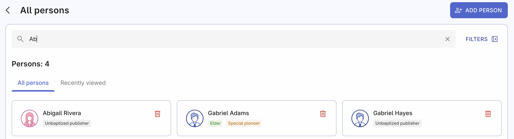
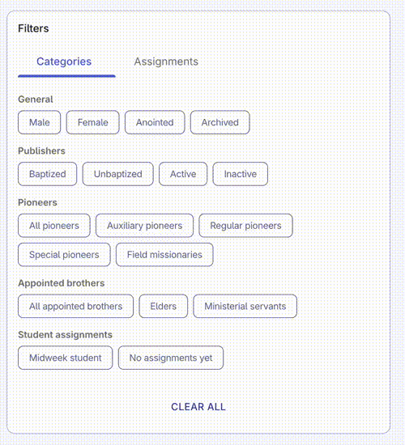

# All persons

The All Persons page is where all the records of your congregation's members are created and stored.

Persons are all people that take part in your congregation's life. That's not only publishers, but also students on a midweek meetings, therefore the page is called Persons. Keeping the information and qualifications of each person up-to-date is important for accurate and efficient reporting and meeting scheduling.

## Add new person

In the top right corner, you'll find the "Add person" button. Clicking on it will allow you to create a new person record and fill out all the necessary details. For step-by-step guidance on this process, check out our [Add person](./add-person) guide page.

## Search function

On this page, you can find everyone in your congregation! Simply search for a specific person or a group of people by using the search field and filters available. Let's see how they work:

### Search field

This page displays everyone in the congregation. To find a specific person, simply start typing their name into the search field. The search results will appear dynamically as you type, allowing you to quickly find the person you're looking for. The search field is designed to search for users by their name.

### Search filters

Search filters allow to search for congregation persons using more specific parameters other then their names, for example by their spiritual status, privileges in congregation, or specific meeting assignment qualifications.

To access the filter panel, simply click on it to expand it. Collapsing the panel won't reset your selected filters.

To apply a filter, click on it once to select it and click again to deselect it. Keep in mind that applying multiple filters may reduce the number of search results.

The 'Applied filters' badge displays the count of filters you've selected, including both categories and assignment qualifications.

## Clear filters

If you need to clear all applied filters, simply click the **'Clear all'** button at the bottom of the filter panel. This will reset all filters, so you don't have to manually deselect each one.

## A person card

You can easily delete person records on this page by clicking the 'Delete' icon on each person's card. Don't worry, you'll be asked to confirm your action before the record is removed. Feel free to try it out and see how it works.

In addition to the person's name, you can see various badges on their record that reflect their spiritual status, ministry, and privileges. These badges may include designations such as unbaptized publisher, midweek student, elder, regular pioneer, inactive publisher, and more. The information displayed on these badges is based on the details entered on each person's record.

## Edit person's details

To view and edit a person's details, simply click on their card. This will take you to their detail page, where you can access and update their spiritual status, assignments, contact information, emergency contacts, and time away dates.

You can find detailed guide and explanations on the [Edit person details](./edit-person-details) guide page. Since there are many different fields and inputs, it's worth taking a closer look.
