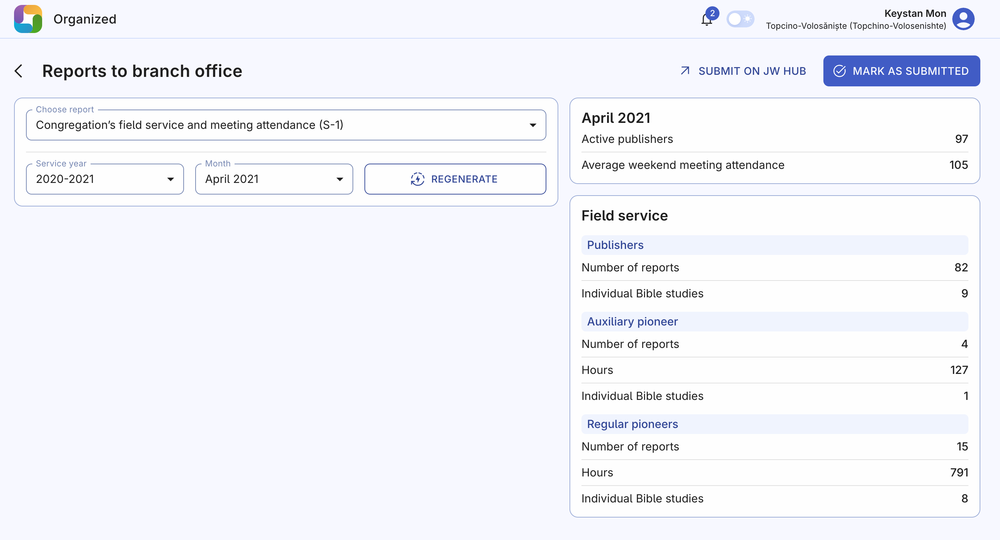
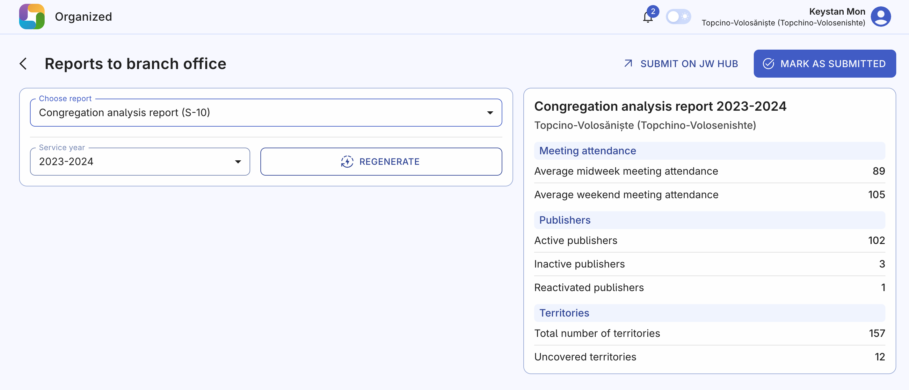

# Reports to branch office

This page assists in generating all the reports that a secretary needs to regularly submit to the local branch office. It gathers all the necessary information from various pages of Organized to provide you with a complete list of report data required by the branch. That's why it's so important to keep all the data in Organized up-to-date and... organized 😉

The following reports are available:

## Congregation’s field service and meeting attendance (S-1)

This is a monthly report that includes average weekend meeting attendance, active publishers count, with a further breakdown into Publishers, Auxiliary pioneers, Regular pioneers and their detailed stats with hours and Bible studies.

## Congregation analysis report (S-10)

This report is submitted once a year, but usually requires many human-hours to prepare by analyzing the whole year's statistics in different congregation's life areas. With Organized, it takes just a few seconds to get a complete report. If you've been timely entering the correct data during the year, you will see all the correct and relevant statistics about meeting attendance, publishers and congregation's territories and be ready to submit it in a moment.

## How to create and submit a report?

### Step 1: Generate in Organized

First, open the Reports to branch office page. Choose a report, desired period (either month or year) and click "Generate". After a short while, you will see a full list of the corresponding report.

### Step 2: Sumbit on JW HUB

Click the "Submit on JW HUB" button at the top of the page. You will be redirected to the report page on hub.jw.org. The only thing left to do is to enter the data that Organized has prepared for you to the JW HUB website and submit the report.

### Step 3: Mark as sumbitted

Once done, click the "Mark as submitted" button for you to surely know that the report has been submitted. Past reports are still available if you select past months or years, so you can view them, but not edit anymore.

:::tip[Need to undo submission?]
You are free to undo a submission and then regenerate a report if needed. But keep in mind that you cannot edit submitted reports from previous months.
:::
