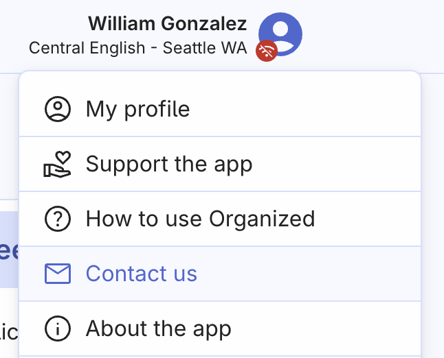

# Contact Organized support

Our support is happy to help you, if you're facing any issues with the app that are not yet covered in this How to use guide articles. There are two ways to reach us out.

## Open an Issue on GitHub

If you encounter a bug or have an idea for improving the Organized app, we encourage you to [submit an Issue](https://github.com/sws2apps/organized-app/issues/new/choose) on our GitHub repository page. This is especially helpful if the issue or idea is relevant to other users as well. If you have generic questions about the app, try creating a new [Discussion post](https://github.com/sws2apps/organized-app/discussions).

By submitting an Issue, you can help us identify and fix problems more quickly, and include them to our roadmap. Your feedback is valuable to us, and we appreciate your help in making the Organized app the best it can be.

## Send an email

If you need to discuss your issue privately or don't have a GitHub or Telegram messenger account, please email us at [support@organized-app.com](mailto:support@organized-app.com). We will do our best to respond to your inquiry as soon as possible and provide any necessary assistance.

You can also use the build-in contact form in the Organized app. Click on your profile picture and click 'Contact us' button.

