# Weekend Meeting

Here is the section where you will manage the meeting parts for the weekend meeting.

## Assign person

### Use autofill

- Click the **AUTOFILL** button at the top of the page.

  

- Select the starting and ending dates you want to autofill, and click **CONTINUE** to confirm.

  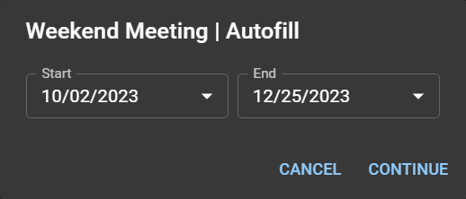

:::info

If some parts were already assigned, the autofill action **will not** override them.

While autofill also will greatly simplify much of your works, we trust that you will use good judgment and balance when doing the assignments. 😉

:::

### Manual assignment

- Locate from the list and expand the week you want edit.

  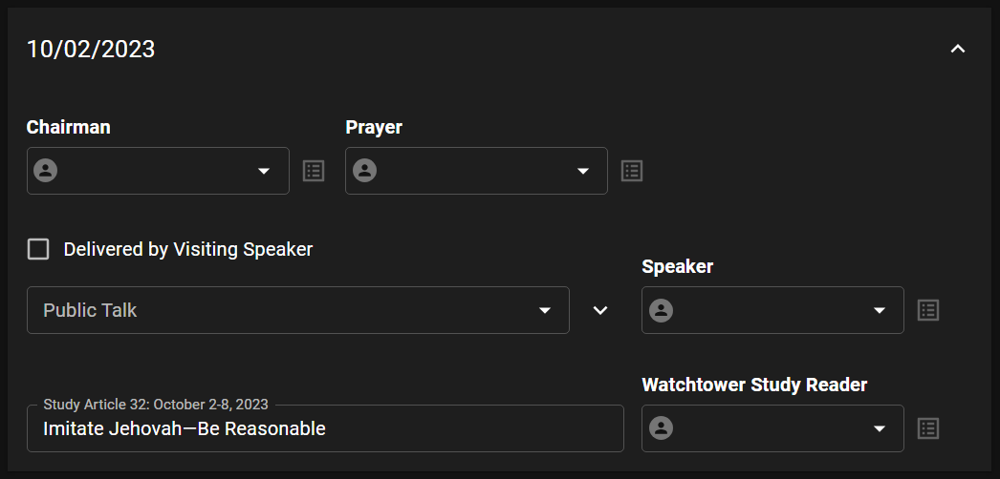

- Choose a person to assign for each meeting part. Please note the following when doing manual assignment:

  - The **last assignment** column is the last time this person was assigned for the same part.

    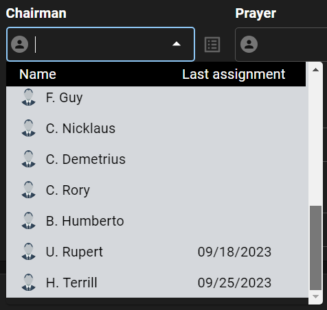

    In the example above, these dates indicate the last time these brothers were used as Chairman.

  - When you select a speaker delivering only a symposium talk, a new field will appear automatically to assign the next speaker.

    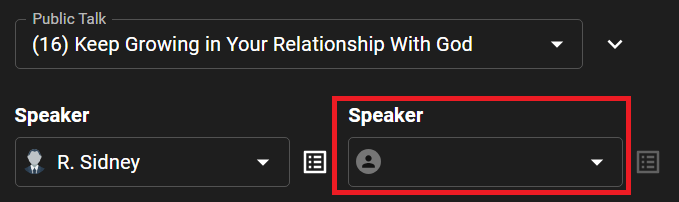

  - Click the _Details_ icon to view all assignments of a person.

    

    The following list will appear:

    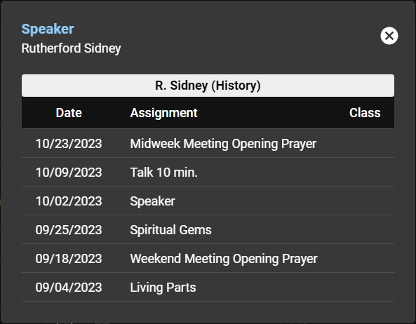

  - To delete an assignment, click the **x** icon next to the person name.

    

### Assign visiting speaker

- Locate from the list and expand the week you want assign a visiting speaker.

- Check the **Delivered by Visiting Speaker** checkbox.

  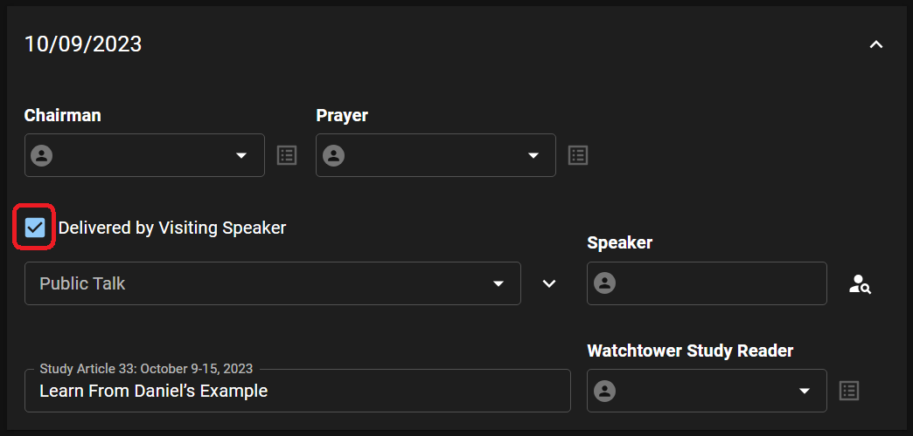

- Click the _Find_ icon to find for a visiting speaker.

  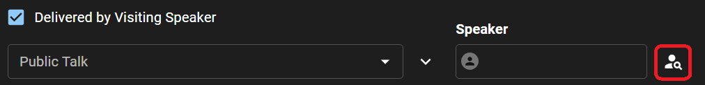

- Choose the speaker and talk by clicking the _Assign_ icon.

  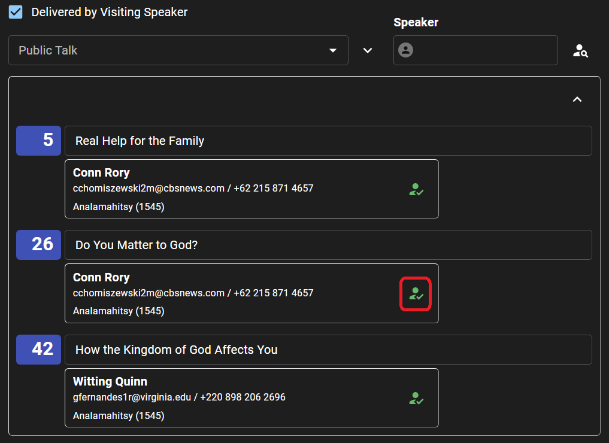

- To remove an assigned visiting speaker, click the _Find_ icon next to his name. Then click the _Remove_ icon.

  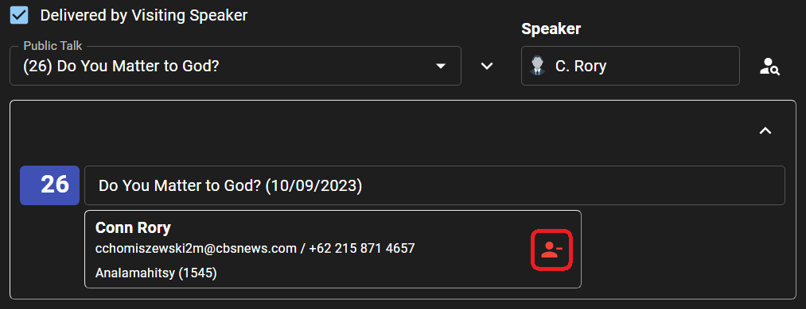

## Delete assignments

- Click the **DELETE** button at the top of the page.

  

- Select the starting and ending dates you want to delete, and click **CONTINUE** to confirm.

  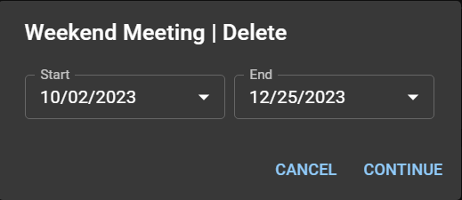

## Export schedule to PDF

- Click the **EXPORT** button at the top of the page.

  

- Select the starting and ending dates you want to export, and click **CONTINUE** to confirm.

  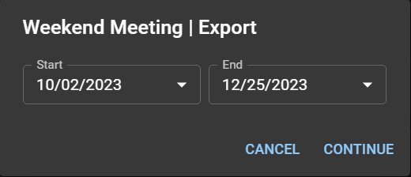

- Depending on your device settings, the PDF file will be downloaded directly or you will be asked where to save it.
