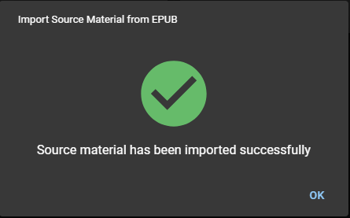

# Import from EPUB file

This is the recommended method to add source materials, when you are using CPE in a device without an internet connection.

- Open jw.org and download the EPUB file.

:::caution

Do not rename the EPUB file downloaded.

:::

- Open CPE, and click **Import from EPUB file** under the Source Material card. Locate the EPUB file you downloaded from jw.org.

- A confirmation message will appear when the import is completed. Click OK to complete.

  
